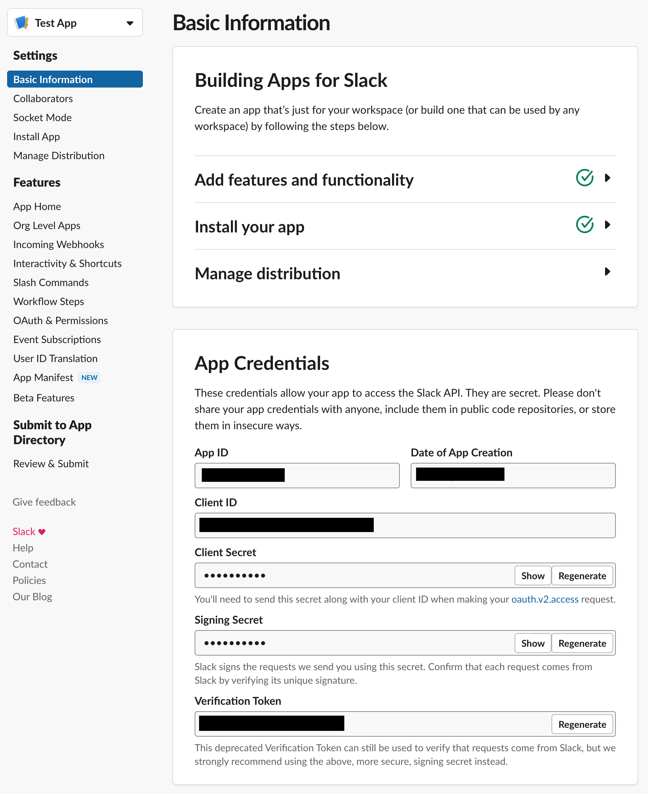
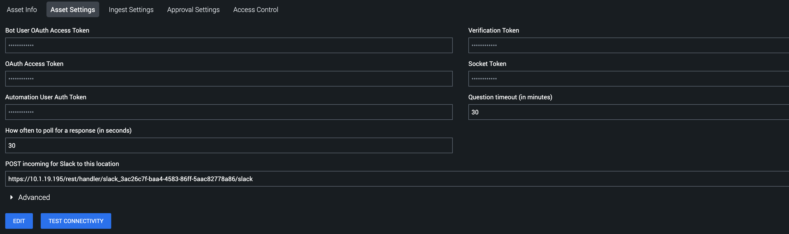
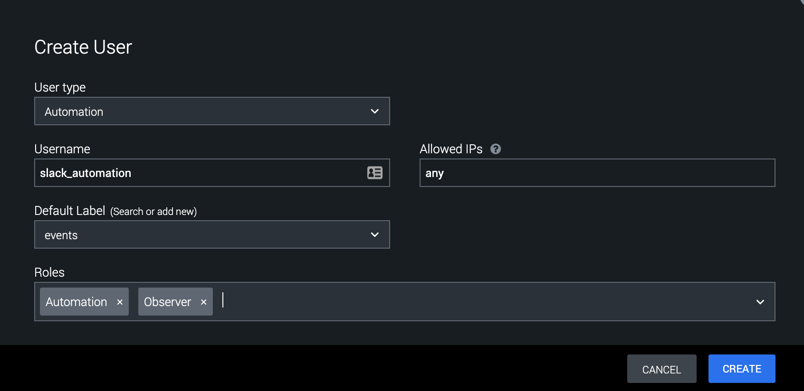

[comment]: # "Auto-generated SOAR connector documentation"

# Slack

Publisher: Splunk  
Connector Version: 2\.3\.0  
Product Vendor: Slack Technologies  
Product Name: Slack  
Product Version Supported (regex): "\.\*"  
Minimum Product Version: 5\.2\.0

Integrate with Slack to post messages and attachments to channels

[comment]: # " File: README.md"
[comment]: # "  Copyright (c) 2016-2022 Splunk Inc."
[comment]: #
[comment]: # "  Licensed under Apache 2.0 (https://www.apache.org/licenses/LICENSE-2.0.txt)"
[comment]: #

## Playbook Backward Compatibility

- The existing action parameters have been modified for the actions given below. Hence, it is
  requested to the end-user to please update their existing playbooks by re-inserting \| modifying
  \| deleting the corresponding action blocks or by providing appropriate values to these action
  parameters to ensure the correct functioning of the playbooks created on the earlier versions of
  the app.

  - Upload File - 4 new action parameters 'filename', 'content', 'parent_message_ts' and
    'filetype' are added which helps to add the file without specifying vault ID in 'file'
    parameter. The 'parent_message_ts' can be used to reply in the thread based on the timestamp
    of the parent message.

  <!-- -->

  - Send Message - 2 new action parameters 'reply_broadcast' and 'parent_message_ts' are added
    which can be used to reply in the thread based on the timestamp of the parent message.
    <!-- -->
    -   Send Message - 1 new action parameter 'blocks' is added which can be used to send richly
        formatted "blocks" as Slack messages. See [Slack
        Documentation](https://api.slack.com/messaging/composing/layouts#adding-blocks) for more
        information.

-   New action 'Add Reaction' has been added. Hence, it is requested to the end-user to please
    update their existing playbooks by inserting the corresponding action blocks for this action on
    the earlier versions of the app.

## Authentication

Phantom's Slack App needs a bot token to read messages from and post messages to slack channels. The
app also needs a verification token to verify POST requests received from Slack.

### Create a Slack App

Creating a Slack App is required to get the proper bot token for authenticating the Phantom Slack
App. To do this, go to <https://api.slack.com/apps> in a browser, and select **Create New App** .

In the pop up window, give the app name and associate it with a Slack team/your Workspace, then
click **Create App** .

On the next page, there is a **Verification Token** . This token will be needed during asset
configuration.

In the menu bar on the left, select **OAuth & Permissions** . On that page, Scroll down to the
**Scopes** section and click **Add an OAuth Scope** to add scopes to your **Bot Token** and **User
Token** .

Next, click on **Install App** in the side bar. On that page, click **Install to Workspace** .

On the next page, click **Allow** .

After authorizing the app, the next window will show the app's authorization tokens. The **Bot User
OAuth Access Token** and **OAuth Access Token** will be required during asset configuration.

## Phantom Base URL

The app uses the Phantom **Base URL** configuration to generate links to actions, so please make
sure a valid url is specified in the **System Settings** .

## Phantom Slack Asset

Fill out the required values in the **Asset Definition** tab.

Fill out the **Bot User OAuth Access Token** , **OAuth Access Token** and **Verification Token** in
the **Asset Settings** tab.

Click **SAVE** , you will be asked to fill in the **Ingest Settings** , select one of the labels
from the drop-down or you can create a new one and Click **SAVE** .

After saving the asset, go back to the **Asset Settings** tab. There will now be a box labeled
**POST incoming for Slack to this location** . This URL will be used later when configuring Slack's
**Interactive Messages** functionality.

### Automation User

The Slack app needs a Phantom authentication token to perform some tasks on the Phantom platform. To
get this token, it is recommended that you create a new automation user. The steps for creating this
user are as follows:

- On the Phantom platform, navigate to **Administration->User Management**

- Under **Users** , click **+ USER**

- In the **Add User** wizard, do the following:

  - Set the **User Type** to **Automation**
  - Give the user a **Username** like "Slack Automation"
  - Set **Allowed IPs** to **127.0.0.1**
  - Set the **Default Label** to the label seen in the Slack asset's **Ingest Settings**
  - Under **Roles** , in addition to the default **Automation** role, add the **Observer** role
  - Click **CREATE**

  

- Once the new user is created, click on the user in the user list

- On the user's page copy the **ph-auth-token** field from the **Authorization Configuration for
  REST API** box

  

- Paste the copied token in the **Automation User Auth Token** on the Slack app's **Asset
  Settings** page

### Test Connectivity

Now, on the **Asset Settings** page, click the **TEST CONNECTIVITY** button, which will display a
text box with progress messages. It will show the bot username and bot user ID that Phantom received
from Slack. Please ensure that these are correct.

### Interactive Messages

In order for Phantom to receive responses to questions from Slack, the functionality needs to be
configured. But first, you will need to create a user to allow Slack to authenticate with Phantom
(This user is separate from the automation user created above).

Navigate back to the **Users** tab in **Administration** , and click on **+ USER** .

In the pop-up window, select the User Type **Local** . Fill out the required username and password
fields. For security reasons DO NOT give the user any roles. This user should only be used to
authenticate POST requests from Slack to Phantom.

## Set up Interactivity in Slack

Go to the **Your apps** option in Slack. From the menu on the left select the **Interactivity &
Shortcuts** option.

NOTE: Slack will only send POST requests to endpoints that have an SSL certificate signed by a
certificate authority.

Once on this page, toggle on **Interactivity** .

In the **Request URL** text box, add the **POST incoming for Slack to this location** URL found in
the **Asset Settings** window. Before saving these changes, add the username and password of the new
user added to Phantom. The URL should end up in the format:

https://\<username>:\<password>@\<phantom_hostname>/rest/handler/slack_3ac26c7f-baa4-4583-86ff-5aac82778a86/slack <!-- pragma: allowlist secret -->
After adding the full URL, click **Enable Interactive Messages**

## Slack Bot

### Ingest Settings

To run the Phantom SlackBot that will get Phantom to take commands from Slack, ingestion needs to be
enabled on the Phantom Slack Asset. To do this go back to the INGEST SETTINGS tab and enable polling
and specify the Polling interval as 10 minutes. The "Label to apply to objects from this source"
setting is ignored by this app, so it can be set to anything.

To check the status of the phantom bot and restart it if not running, you can Click POLL NOW from
the INGEST SETTINGS app and then POLL NOW again. The "Source ID", "Maximum containers", and "Maximum
artifacts" settings can be ignored in this case.

The POLL NOW window will display the PID of the SlackBot process as well as the number of artifacts
and containers ingested (which will always be zero for this app).

### Stopping SlackBot

Once the Phantom SlackBot starts running, the **stop bot** action needs to be run to stop it. Simply
disabling ingestion won't stop SlackBot.  
WARNING: Stopping SlackBot is required before upgrading or uninstalling the Phantom Slack App or
else an untracked SlackBot process may be left running on the Phantom instance. In addition,
deleting a Slack asset that has SlackBot running will result in SlackBot continuing to run,
untracked.

## Slack Commands

Once a Slack asset has been configured, and SlackBot is running on Phantom, it needs to be invited
to the channel, and then commands from Slack can be received by Phantom. In Slack, just mention the
bot to get a help message on running commands. All commands follow this syntax:

@BOT_NAME COMMAND COMMAND_PARAMETERS

### Running Actions

To run an action on Phantom from Slack, use the **act** command. The syntax of which is:

    @BOT_NAME act ACTION_NAME [--container CONTAINER_ID] [--asset ASSET] [--name NAME]
        [--type TYPE] [--parameters PARAMETER:VALUE [PARAMETER:VALUE]*]

    required parameters:
      ACTION_NAME       The name of the action to run on Phantom
      --container       ID of the container to run the action on

    optional parameters:
      --name            Set a name for the action (defaults to 'Slack generated action')
      --type            Set the type of the action (defaults to 'phantombot')
      --asset           Name or ID of the asset to run the action on
                        If no asset is specified, the given action will run on all possible assets
      --parameters      List of parameter/value pairs in the format
                        param1:value1 param2:value2...

    examples:
      To run the action "list channels" on container 123 using the "slack" asset:

        @phantombot act "list channels" --container 123 --asset slack

      To run the action "whois ip" on 1.1.1.1 using the "whois" asset:

        @phantombot act "whois ip" --container 123 --asset whois --parameters ip:1.1.1.1

      To run all possible "whois ip" actions on 1.1.1.1 using all assets that support the action, and giving it the name "All WhoIs":

        @phantombot act "whois ip" --container 123 --parameters ip:1.1.1.1 --name "All WhoIs"

After receiving an **act** command, SlackBot will kick off the action and send a link to the action
page to Slack. When the action is complete, SlackBot will send a summary of the action results to
Slack. If multiple actions are run at once, SlackBot will send action results for each action
separately as each action completes.

### Running Playbooks

To run a playbook on Phantom from Slack, use the **run_playbook** command. The syntax of which is:

    @BOT_NAME run_playbook [--repo REPO] PLAYBOOK CONTAINER_ID

    required parameters:
      PLAYBOOK          Name or ID of the playbook to run
      CONTAINER_ID      ID of container to run the playbook on

    optional parameters:
      --repo REPO       Name of the repo the playbook is in (required if the
                        playbook argument is a name and not an ID)"

    examples:
      To run the playbook "investigate" which is in the "community" repo, on container 123

        @phantombot run_playbook --repo community investigate 123

      To run the playbook with ID 32 on container 123:

        @phantombot run_playbook 32 123

After receiving a **run_playbook** command, SlackBot will kick off the playbook and send a link to
the container's mission control page to slack. When the playbook has finished running, SlackBot will
send a status report of the playbook's run to Slack.

### Getting Container Information

To get information about a container, use the **get_container** command. The syntax of which is:

    @BOT_NAME get_container [--container CONTAINER] [--tags TAG [TAG]*]

    parameters:
      --container       ID of the container to retrieve
      --tags            List of tags of containers to retrieve

    Only one of --container or --tags flags can be included at once
    Using the --tags flag will return a small summary of containers with the given tag.

    examples:
      To get information on container 123:

        @phantombot get_container 123

      To get a list of containers with the tag "my_tag"

        @phantombot get_container --tags my_tag

      To get a list of containers with one of the following tags: "tag1" "tag2" or "tag3"

        @phantombot get_container --tags tag1 tag2 tag3

Running a **get_container** command will result in SlackBot sending either a list of containers or a
set of information on one container to Slack.

### Listing Actions or Containers

To get a list of actions or containers, use the **list** command. The syntax of which is:

    @BOT_NAME list [actions|containers]

    parameters:
      object        name of an object to list can be 'actions' or 'containers'

    WARNING: If there are many containers on the system, the 'list containers' command can take a long time and can result in a lot of data being dumped on Slack

    examples:
      To get a list of all actions on the Phantom instance:

        @phantombot list actions

      To get a list of all containers on the Phantom instance:

        @phantombot list containers

Running a **list** command will result in SlackBot sending a list of either actions or containers to
Slack.

### Configuration Variables

The below configuration variables are required for this Connector to operate. These variables are specified when configuring a Slack asset in SOAR.

| VARIABLE                   | REQUIRED | TYPE     | DESCRIPTION                                     |
| -------------------------- | -------- | -------- | ----------------------------------------------- |
| **bot_token**              | required | password | Bot User OAuth Access Token                     |
| **verification_token**     | required | password | Verification Token                              |
| **user_token**             | optional | password | OAuth Access Token                              |
| **ph_0**                   | optional | ph       | Placeholder                                     |
| **ph_auth_token**          | optional | password | Automation User Auth Token                      |
| **timeout**                | optional | numeric  | Question timeout \(in minutes\)                 |
| **response_poll_interval** | optional | numeric  | How often to poll for a response \(in seconds\) |

### Supported Actions

[test connectivity](#action-test-connectivity) - Tests authorization with Slack  
[create channel](#action-create-channel) - Create a new Slack channel  
[list channels](#action-list-channels) - List public channels of a Slack team  
[list users](#action-list-users) - List users of a Slack team  
[get user](#action-get-user) - Get information about a user of a Slack team  
[invite users](#action-invite-users) - Invite user\(s\) to a Slack channel  
[send message](#action-send-message) - Send a message to Slack  
[add reaction](#action-add-reaction) - React to a message in Slack  
[upload file](#action-upload-file) - Upload file to Slack  
[ask question](#action-ask-question) - Ask a question to a Slack user  
[get response](#action-get-response) - Get the response to a previously asked question  
[on poll](#action-on-poll) - Start SlackBot and make health checks to it  
[stop bot](#action-stop-bot) - Stop SlackBot

## action: 'test connectivity'

Tests authorization with Slack

Type: **test**  
Read only: **True**

Checks that the provided bot token is valid and grabs information about the configured bot user\.

#### Action Parameters

No parameters are required for this action

#### Action Output

No Output

## action: 'create channel'

Create a new Slack channel

Type: **generic**  
Read only: **False**

To create a private channel, use the 'channel_type' selection parameter\. This action requires a OAuth Access Token defined in the asset\. For naming conventions, see https\://api\.slack\.com/methods/conversations\.create\.

#### Action Parameters

| PARAMETER        | REQUIRED | DESCRIPTION                                     | TYPE   | CONTAINS |
| ---------------- | -------- | ----------------------------------------------- | ------ | -------- |
| **name**         | required | Name of channel                                 | string |
| **channel_type** | optional | Type of channel to create \(public or private\) | string |

#### Action Output

| DATA PATH                                               | TYPE    | CONTAINS             |
| ------------------------------------------------------- | ------- | -------------------- |
| action_result\.parameter\.channel_type                  | string  |
| action_result\.parameter\.name                          | string  |
| action_result\.data\.\*\.warning                        | string  |
| action_result\.data\.\*\.ok                             | boolean |
| action_result\.data\.\*\.channel\.is_general            | boolean |
| action_result\.data\.\*\.channel\.name_normalized       | string  |
| action_result\.data\.\*\.channel\.is_channel            | boolean |
| action_result\.data\.\*\.channel\.creator               | string  |
| action_result\.data\.\*\.channel\.is_member             | boolean |
| action_result\.data\.\*\.channel\.is_archived           | boolean |
| action_result\.data\.\*\.channel\.topic\.last_set       | numeric |
| action_result\.data\.\*\.channel\.topic\.value          | string  |
| action_result\.data\.\*\.channel\.topic\.creator        | string  |
| action_result\.data\.\*\.channel\.parent_conversation   | string  |
| action_result\.data\.\*\.channel\.is_im                 | boolean |
| action_result\.data\.\*\.channel\.id                    | string  |
| action_result\.data\.\*\.channel\.is_org_shared         | boolean |
| action_result\.data\.\*\.channel\.last_read             | string  |
| action_result\.data\.\*\.channel\.is_ext_shared         | boolean |
| action_result\.data\.\*\.channel\.is_pending_ext_shared | boolean |
| action_result\.data\.\*\.channel\.is_mpim               | boolean |
| action_result\.data\.\*\.channel\.is_group              | boolean |
| action_result\.data\.\*\.channel\.shared_team_ids       | string  |
| action_result\.data\.\*\.channel\.purpose\.last_set     | numeric |
| action_result\.data\.\*\.channel\.purpose\.value        | string  |
| action_result\.data\.\*\.channel\.purpose\.creator      | string  |
| action_result\.data\.\*\.channel\.is_private            | boolean |
| action_result\.data\.\*\.channel\.name                  | string  | `slack channel name` |
| action_result\.data\.\*\.channel\.is_shared             | boolean |
| action_result\.data\.\*\.channel\.created               | numeric |
| action_result\.data\.\*\.channel\.unlinked              | numeric |
| action_result\.data\.\*\.channel\.priority              | numeric |
| action_result\.data\.\*\.channel\.is_open               | boolean |
| action_result\.data\.\*\.response_metadata\.warnings    | string  |
| action_result\.status                                   | string  |
| action_result\.message                                  | string  |
| action_result\.summary                                  | string  |
| summary\.total_objects                                  | numeric |
| summary\.total_objects_successful                       | numeric |

## action: 'list channels'

List public channels of a Slack team

Type: **investigate**  
Read only: **True**

The output of this action is a list of all public channels in the configured Slack team\. The channels will be listed with their corresponding channel IDs\.

#### Action Parameters

| PARAMETER | REQUIRED | DESCRIPTION                                                      | TYPE    | CONTAINS |
| --------- | -------- | ---------------------------------------------------------------- | ------- | -------- |
| **limit** | optional | Specify the maximum number of results to return\. Default is 100 | numeric |

#### Action Output

| DATA PATH                                                    | TYPE    | CONTAINS             |
| ------------------------------------------------------------ | ------- | -------------------- |
| action_result\.parameter\.limit                              | numeric |
| action_result\.data\.\*\.channels\.\*\.created               | numeric |
| action_result\.data\.\*\.channels\.\*\.creator               | string  |
| action_result\.data\.\*\.channels\.\*\.id                    | string  | `slack channel id`   |
| action_result\.data\.\*\.channels\.\*\.is_archived           | boolean |
| action_result\.data\.\*\.channels\.\*\.is_channel            | boolean |
| action_result\.data\.\*\.channels\.\*\.is_general            | boolean |
| action_result\.data\.\*\.channels\.\*\.is_member             | boolean |
| action_result\.data\.\*\.channels\.\*\.members               | string  |
| action_result\.data\.\*\.channels\.\*\.name                  | string  | `slack channel name` |
| action_result\.data\.\*\.channels\.\*\.num_members           | numeric |
| action_result\.data\.\*\.channels\.\*\.purpose\.creator      | string  |
| action_result\.data\.\*\.channels\.\*\.purpose\.last_set     | numeric |
| action_result\.data\.\*\.channels\.\*\.purpose\.value        | string  |
| action_result\.data\.\*\.channels\.\*\.topic\.creator        | string  |
| action_result\.data\.\*\.channels\.\*\.topic\.last_set       | numeric |
| action_result\.data\.\*\.channels\.\*\.topic\.value          | string  |
| action_result\.data\.\*\.channels\.\*\.is_im                 | boolean |
| action_result\.data\.\*\.channels\.\*\.is_mpim               | boolean |
| action_result\.data\.\*\.channels\.\*\.is_group              | boolean |
| action_result\.data\.\*\.channels\.\*\.unlinked              | numeric |
| action_result\.data\.\*\.channels\.\*\.is_shared             | boolean |
| action_result\.data\.\*\.channels\.\*\.is_private            | boolean |
| action_result\.data\.\*\.channels\.\*\.is_ext_shared         | boolean |
| action_result\.data\.\*\.channels\.\*\.is_org_shared         | boolean |
| action_result\.data\.\*\.channels\.\*\.name_normalized       | string  |
| action_result\.data\.\*\.channels\.\*\.parent_conversation   | string  |
| action_result\.data\.\*\.channels\.\*\.is_pending_ext_shared | boolean |
| action_result\.data\.\*\.response_metadata\.next_cursor      | string  |
| action_result\.data\.\*\.ok                                  | boolean |
| action_result\.status                                        | string  |
| action_result\.message                                       | string  |
| action_result\.summary                                       | string  |
| action_result\.summary\.num_public_channels                  | numeric |
| summary\.total_objects                                       | numeric |
| summary\.total_objects_successful                            | numeric |

## action: 'list users'

List users of a Slack team

Type: **investigate**  
Read only: **True**

#### Action Parameters

| PARAMETER | REQUIRED | DESCRIPTION                                                      | TYPE    | CONTAINS |
| --------- | -------- | ---------------------------------------------------------------- | ------- | -------- |
| **limit** | optional | Specify the maximum number of results to return\. Default is 100 | numeric |

#### Action Output

| DATA PATH                                                              | TYPE    | CONTAINS          |
| ---------------------------------------------------------------------- | ------- | ----------------- |
| action_result\.parameter\.limit                                        | numeric |
| action_result\.data\.\*\.cache_ts                                      | numeric |
| action_result\.data\.\*\.members\.\*\.color                            | string  |
| action_result\.data\.\*\.members\.\*\.deleted                          | boolean |
| action_result\.data\.\*\.members\.\*\.id                               | string  | `slack user id`   |
| action_result\.data\.\*\.members\.\*\.is_admin                         | boolean |
| action_result\.data\.\*\.members\.\*\.is_bot                           | boolean |
| action_result\.data\.\*\.members\.\*\.is_owner                         | boolean |
| action_result\.data\.\*\.members\.\*\.is_primary_owner                 | boolean |
| action_result\.data\.\*\.members\.\*\.is_restricted                    | boolean |
| action_result\.data\.\*\.members\.\*\.is_ultra_restricted              | boolean |
| action_result\.data\.\*\.members\.\*\.name                             | string  | `slack user name` |
| action_result\.data\.\*\.members\.\*\.profile\.always_active           | boolean |
| action_result\.data\.\*\.members\.\*\.profile\.api_app_id              | string  |
| action_result\.data\.\*\.members\.\*\.profile\.avatar_hash             | string  |
| action_result\.data\.\*\.members\.\*\.profile\.bot_id                  | string  |
| action_result\.data\.\*\.members\.\*\.profile\.email                   | string  | `email`           |
| action_result\.data\.\*\.members\.\*\.profile\.first_name              | string  |
| action_result\.data\.\*\.members\.\*\.profile\.image_1024              | string  | `url`             |
| action_result\.data\.\*\.members\.\*\.profile\.image_192               | string  | `url`             |
| action_result\.data\.\*\.members\.\*\.profile\.image_24                | string  | `url`             |
| action_result\.data\.\*\.members\.\*\.profile\.image_32                | string  | `url`             |
| action_result\.data\.\*\.members\.\*\.profile\.image_48                | string  | `url`             |
| action_result\.data\.\*\.members\.\*\.profile\.image_512               | string  | `url`             |
| action_result\.data\.\*\.members\.\*\.profile\.image_72                | string  | `url`             |
| action_result\.data\.\*\.members\.\*\.profile\.image_original          | string  | `url`             |
| action_result\.data\.\*\.members\.\*\.profile\.last_name               | string  |
| action_result\.data\.\*\.members\.\*\.profile\.real_name               | string  |
| action_result\.data\.\*\.members\.\*\.profile\.real_name_normalized    | string  |
| action_result\.data\.\*\.members\.\*\.profile\.title                   | string  |
| action_result\.data\.\*\.members\.\*\.real_name                        | string  |
| action_result\.data\.\*\.members\.\*\.team_id                          | string  |
| action_result\.data\.\*\.members\.\*\.tz                               | string  |
| action_result\.data\.\*\.members\.\*\.tz_label                         | string  |
| action_result\.data\.\*\.members\.\*\.tz_offset                        | numeric |
| action_result\.data\.\*\.members\.\*\.updated                          | numeric |
| action_result\.data\.\*\.members\.\*\.profile\.team                    | string  |
| action_result\.data\.\*\.members\.\*\.profile\.phone                   | string  |
| action_result\.data\.\*\.members\.\*\.profile\.skype                   | string  |
| action_result\.data\.\*\.members\.\*\.profile\.fields                  | string  |
| action_result\.data\.\*\.members\.\*\.profile\.status_text             | string  |
| action_result\.data\.\*\.members\.\*\.profile\.display_name            | string  |
| action_result\.data\.\*\.members\.\*\.profile\.status_emoji            | string  |
| action_result\.data\.\*\.members\.\*\.profile\.status_expiration       | numeric |
| action_result\.data\.\*\.members\.\*\.profile\.status_text_canonical   | string  |
| action_result\.data\.\*\.members\.\*\.profile\.display_name_normalized | string  |
| action_result\.data\.\*\.members\.\*\.is_app_user                      | boolean |
| action_result\.data\.\*\.members\.\*\.is_email_confirmed               | boolean |
| action_result\.data\.\*\.members\.\*\.profile\.is_custom_image         | boolean |
| action_result\.data\.\*\.members\.\*\.is_invited_user                  | boolean |
| action_result\.data\.\*\.response_metadata\.next_cursor                | string  |
| action_result\.data\.\*\.ok                                            | boolean |
| action_result\.status                                                  | string  |
| action_result\.message                                                 | string  |
| action_result\.summary\.num_users                                      | numeric |
| summary\.total_objects                                                 | numeric |
| summary\.total_objects_successful                                      | numeric |

## action: 'get user'

Get information about a user of a Slack team

Type: **investigate**  
Read only: **True**

#### Action Parameters

| PARAMETER   | REQUIRED | DESCRIPTION               | TYPE   | CONTAINS        |
| ----------- | -------- | ------------------------- | ------ | --------------- |
| **user_id** | required | ID of user to get info of | string | `slack user id` |

#### Action Output

| DATA PATH                                                       | TYPE    | CONTAINS          |
| --------------------------------------------------------------- | ------- | ----------------- |
| action_result\.parameter\.user_id                               | string  | `slack user id`   |
| action_result\.data\.\*\.ok                                     | boolean |
| action_result\.data\.\*\.user\.color                            | string  |
| action_result\.data\.\*\.user\.deleted                          | boolean |
| action_result\.data\.\*\.user\.id                               | string  | `slack user id`   |
| action_result\.data\.\*\.user\.is_admin                         | boolean |
| action_result\.data\.\*\.user\.is_bot                           | boolean |
| action_result\.data\.\*\.user\.is_owner                         | boolean |
| action_result\.data\.\*\.user\.is_primary_owner                 | boolean |
| action_result\.data\.\*\.user\.is_restricted                    | boolean |
| action_result\.data\.\*\.user\.is_ultra_restricted              | boolean |
| action_result\.data\.\*\.user\.name                             | string  | `slack user name` |
| action_result\.data\.\*\.user\.profile\.avatar_hash             | string  |
| action_result\.data\.\*\.user\.profile\.email                   | string  | `email`           |
| action_result\.data\.\*\.user\.profile\.first_name              | string  |
| action_result\.data\.\*\.user\.profile\.image_192               | string  | `url`             |
| action_result\.data\.\*\.user\.profile\.image_24                | string  | `url`             |
| action_result\.data\.\*\.user\.profile\.image_32                | string  | `url`             |
| action_result\.data\.\*\.user\.profile\.image_48                | string  | `url`             |
| action_result\.data\.\*\.user\.profile\.image_512               | string  | `url`             |
| action_result\.data\.\*\.user\.profile\.image_72                | string  | `url`             |
| action_result\.data\.\*\.user\.profile\.last_name               | string  |
| action_result\.data\.\*\.user\.profile\.real_name               | string  |
| action_result\.data\.\*\.user\.profile\.real_name_normalized    | string  |
| action_result\.data\.\*\.user\.real_name                        | string  |
| action_result\.data\.\*\.user\.team_id                          | string  |
| action_result\.data\.\*\.user\.tz                               | string  |
| action_result\.data\.\*\.user\.tz_label                         | string  |
| action_result\.data\.\*\.user\.tz_offset                        | numeric |
| action_result\.data\.\*\.user\.updated                          | numeric |
| action_result\.data\.\*\.user\.profile\.team                    | string  |
| action_result\.data\.\*\.user\.profile\.phone                   | string  |
| action_result\.data\.\*\.user\.profile\.skype                   | string  |
| action_result\.data\.\*\.user\.profile\.title                   | string  |
| action_result\.data\.\*\.user\.profile\.fields                  | string  |
| action_result\.data\.\*\.user\.profile\.status_text             | string  |
| action_result\.data\.\*\.user\.profile\.display_name            | string  |
| action_result\.data\.\*\.user\.profile\.status_emoji            | string  |
| action_result\.data\.\*\.user\.profile\.always_active           | boolean |
| action_result\.data\.\*\.user\.profile\.status_expiration       | numeric |
| action_result\.data\.\*\.user\.profile\.status_text_canonical   | string  |
| action_result\.data\.\*\.user\.profile\.display_name_normalized | string  |
| action_result\.data\.\*\.user\.is_app_user                      | boolean |
| action_result\.data\.\*\.user\.is_email_confirmed               | boolean |
| action_result\.data\.\*\.user\.profile\.bot_id                  | string  |
| action_result\.data\.\*\.user\.profile\.api_app_id              | string  |
| action_result\.status                                           | string  |
| action_result\.message                                          | string  |
| action_result\.summary                                          | string  |
| summary\.total_objects                                          | numeric |
| summary\.total_objects_successful                               | numeric |

## action: 'invite users'

Invite user\(s\) to a Slack channel

Type: **generic**  
Read only: **False**

Up to 1000 users may be added at one time\. This action requires a OAuth Access Token defined in the asset\. For permissions, see\: https\://api\.slack\.com/methods/conversations\.invite\.

#### Action Parameters

| PARAMETER      | REQUIRED | DESCRIPTION                                      | TYPE   | CONTAINS           |
| -------------- | -------- | ------------------------------------------------ | ------ | ------------------ |
| **channel_id** | required | ID of channel                                    | string | `slack channel id` |
| **users**      | required | Comma\-separated list of users \(IDs\) to invite | string |

#### Action Output

| DATA PATH                                               | TYPE    | CONTAINS             |
| ------------------------------------------------------- | ------- | -------------------- |
| action_result\.parameter\.users                         | string  |
| action_result\.parameter\.channel_id                    | string  | `slack channel id`   |
| action_result\.data\.\*\.warning                        | string  |
| action_result\.data\.\*\.ok                             | boolean |
| action_result\.data\.\*\.channel\.is_general            | boolean |
| action_result\.data\.\*\.channel\.name_normalized       | string  |
| action_result\.data\.\*\.channel\.is_channel            | boolean |
| action_result\.data\.\*\.channel\.creator               | string  |
| action_result\.data\.\*\.channel\.is_member             | boolean |
| action_result\.data\.\*\.channel\.is_archived           | boolean |
| action_result\.data\.\*\.channel\.topic\.last_set       | numeric |
| action_result\.data\.\*\.channel\.topic\.value          | string  |
| action_result\.data\.\*\.channel\.topic\.creator        | string  |
| action_result\.data\.\*\.channel\.parent_conversation   | string  |
| action_result\.data\.\*\.channel\.is_im                 | boolean |
| action_result\.data\.\*\.channel\.id                    | string  |
| action_result\.data\.\*\.channel\.is_org_shared         | boolean |
| action_result\.data\.\*\.channel\.last_read             | string  |
| action_result\.data\.\*\.channel\.is_ext_shared         | boolean |
| action_result\.data\.\*\.channel\.is_pending_ext_shared | boolean |
| action_result\.data\.\*\.channel\.is_mpim               | boolean |
| action_result\.data\.\*\.channel\.is_group              | boolean |
| action_result\.data\.\*\.channel\.shared_team_ids       | string  |
| action_result\.data\.\*\.channel\.purpose\.last_set     | numeric |
| action_result\.data\.\*\.channel\.purpose\.value        | string  |
| action_result\.data\.\*\.channel\.purpose\.creator      | string  |
| action_result\.data\.\*\.channel\.is_private            | boolean |
| action_result\.data\.\*\.channel\.name                  | string  | `slack channel name` |
| action_result\.data\.\*\.channel\.is_shared             | boolean |
| action_result\.data\.\*\.channel\.created               | numeric |
| action_result\.data\.\*\.channel\.unlinked              | numeric |
| action_result\.data\.\*\.response_metadata\.warnings    | string  |
| action_result\.status                                   | string  |
| action_result\.message                                  | string  |
| action_result\.summary                                  | string  |
| summary\.total_objects                                  | numeric |
| summary\.total_objects_successful                       | numeric |

## action: 'send message'

Send a message to Slack

Type: **generic**  
Read only: **False**

The <b>destination</b> parameter can be a channel ID \(e\.g\. C1A1A1AAA\), a channel name \(e\.g\. \#general\)\. When sending a message to a channel, the configured bot user must have been added to the channel\. Messages are limited to 4000 characters\. Passing a "username" as a channel value is deprecated, along with the whole concept of usernames on Slack\. Please always use channel\-like IDs instead to make sure your message gets to where it's going\.

PARAMETER | REQUIRED | DESCRIPTION | TYPE | CONTAINS
--------- | -------- | ----------- | ---- | --------
**destination** |  required  | Channel \(e\.g\. \#channel or C1A1A1AAA\) | string |  `slack channel name`  `slack channel id`  `slack user name`  `slack user id` 
**message** |  optional  | Message to send, required if 'blocks' is not set\. If 'blocks' is set, this is used as fallback text | string | 
**blocks** |  optional  | Blocks to send, required if 'message' is not set | string | 
**parent\_message\_ts** |  optional  | Parent message timestamp to reply in thread | string |  `slack message ts` 
**reply\_broadcast** |  optional  | Used in conjunction with 'parent\_message\_ts' and indicates whether reply should be made visible to everyone in the channel or conversation | boolean | 
**link\_names** |  optional  | Check this if you want to enable announcements in your Slack messages using mentions\. E\.g\.\: Use \@someone or \@channel in your message in combination with this check to notify people | boolean | 

DATA PATH | TYPE | CONTAINS
--------- | ---- | --------
action\_result\.parameter\.destination | string |  `slack channel name`  `slack channel id`  `slack user name`  `slack user id` 
action\_result\.parameter\.parent\_message\_ts | string |  `slack message ts` 
action\_result\.parameter\.blocks | string | 
action\_result\.parameter\.message | string | 
action\_result\.parameter\.reply\_broadcast | boolean | 
action\_result\.parameter\.link\_names | boolean | 
action\_result\.data\.\*\.channel | string |  `slack channel id` 
action\_result\.data\.\*\.message\.bot\_id | string | 
action\_result\.data\.\*\.message\.text | string | 
action\_result\.data\.\*\.message\.ts | string |  `slack message ts` 
action\_result\.data\.\*\.message\.type | string | 
action\_result\.data\.\*\.message\.user | string | 
action\_result\.data\.\*\.ok | boolean | 
action\_result\.data\.\*\.message\.team | string | 
action\_result\.data\.\*\.message\.bot\_profile\.id | string | 
action\_result\.data\.\*\.message\.bot\_profile\.name | string | 
action\_result\.data\.\*\.message\.bot\_profile\.icons\.image\_36 | string | 
action\_result\.data\.\*\.message\.bot\_profile\.icons\.image\_48 | string | 
action\_result\.data\.\*\.message\.bot\_profile\.icons\.image\_72 | string | 
action\_result\.data\.\*\.message\.bot\_profile\.app\_id | string | 
action\_result\.data\.\*\.message\.bot\_profile\.deleted | boolean | 
action\_result\.data\.\*\.message\.bot\_profile\.team\_id | string | 
action\_result\.data\.\*\.message\.bot\_profile\.updated | numeric | 
action\_result\.data\.\*\.message\.subtype | string | 
action\_result\.data\.\*\.message\.thread\_ts | string | 
action\_result\.data\.\*\.message\.parent\_user\_id | string | 
action\_result\.data\.\*\.message\.root\.ts | string | 
action\_result\.data\.\*\.message\.root\.team | string | 
action\_result\.data\.\*\.message\.root\.text | string | 
action\_result\.data\.\*\.message\.root\.type | string | 
action\_result\.data\.\*\.message\.root\.user | string | 
action\_result\.data\.\*\.message\.root\.bot\_id | string | 
action\_result\.data\.\*\.message\.root\.thread\_ts | string | 
action\_result\.data\.\*\.message\.root\.subscribed | boolean | 
action\_result\.data\.\*\.message\.root\.bot\_profile\.id | string | 
action\_result\.data\.\*\.message\.root\.bot\_profile\.name | string | 
action\_result\.data\.\*\.message\.root\.bot\_profile\.icons\.image\_36 | string | 
action\_result\.data\.\*\.message\.root\.bot\_profile\.icons\.image\_48 | string | 
action\_result\.data\.\*\.message\.root\.bot\_profile\.icons\.image\_72 | string | 
action\_result\.data\.\*\.message\.root\.bot\_profile\.app\_id | string | 
action\_result\.data\.\*\.message\.root\.bot\_profile\.deleted | boolean | 
action\_result\.data\.\*\.message\.root\.bot\_profile\.team\_id | string | 
action\_result\.data\.\*\.message\.root\.bot\_profile\.updated | numeric | 
action\_result\.data\.\*\.message\.root\.reply\_count | numeric | 
action\_result\.data\.\*\.message\.root\.latest\_reply | string | 
action\_result\.data\.\*\.message\.root\.reply\_users\_count | numeric | 
action\_result\.data\.\*\.message\.root\.files\.\*\.id | string | 
action\_result\.data\.\*\.message\.root\.files\.\*\.mode | string | 
action\_result\.data\.\*\.message\.root\.files\.\*\.name | string | 
action\_result\.data\.\*\.message\.root\.files\.\*\.size | numeric | 
action\_result\.data\.\*\.message\.root\.files\.\*\.user | string | 
action\_result\.data\.\*\.message\.root\.files\.\*\.lines | numeric | 
action\_result\.data\.\*\.message\.root\.files\.\*\.title | string | 
action\_result\.data\.\*\.message\.root\.files\.\*\.created | numeric | 
action\_result\.data\.\*\.message\.root\.files\.\*\.preview | string | 
action\_result\.data\.\*\.message\.root\.files\.\*\.editable | boolean | 
action\_result\.data\.\*\.message\.root\.files\.\*\.filetype | string | 
action\_result\.data\.\*\.message\.root\.files\.\*\.mimetype | string | 
action\_result\.data\.\*\.message\.root\.files\.\*\.username | string | 
action\_result\.data\.\*\.message\.root\.files\.\*\.edit\_link | string | 
action\_result\.data\.\*\.message\.root\.files\.\*\.is\_public | boolean | 
action\_result\.data\.\*\.message\.root\.files\.\*\.permalink | string | 
action\_result\.data\.\*\.message\.root\.files\.\*\.timestamp | numeric | 
action\_result\.data\.\*\.message\.root\.files\.\*\.is\_starred | boolean | 
action\_result\.data\.\*\.message\.root\.files\.\*\.lines\_more | numeric | 
action\_result\.data\.\*\.message\.root\.files\.\*\.is\_external | boolean | 
action\_result\.data\.\*\.message\.root\.files\.\*\.pretty\_type | string | 
action\_result\.data\.\*\.message\.root\.files\.\*\.url\_private | string | 
action\_result\.data\.\*\.message\.root\.files\.\*\.external\_type | string | 
action\_result\.data\.\*\.message\.root\.files\.\*\.display\_as\_bot | boolean | 
action\_result\.data\.\*\.message\.root\.files\.\*\.has\_rich\_preview | boolean | 
action\_result\.data\.\*\.message\.root\.files\.\*\.permalink\_public | string | 
action\_result\.data\.\*\.message\.root\.files\.\*\.preview\_highlight | string | 
action\_result\.data\.\*\.message\.root\.files\.\*\.public\_url\_shared | boolean | 
action\_result\.data\.\*\.message\.root\.files\.\*\.preview\_is\_truncated | boolean | 
action\_result\.data\.\*\.message\.root\.files\.\*\.url\_private\_download | string | 
action\_result\.data\.\*\.message\.root\.upload | boolean | 
action\_result\.data\.\*\.message\.root\.display\_as\_bot | boolean | 
action\_result\.data\.\*\.ts | string | 
action\_result\.status | string | 
action\_result\.message | string | 
action\_result\.summary | string | 
summary\.total\_objects | numeric | 
summary\.total\_objects\_successful | numeric |   
## action: 'add reaction'

React to a message in Slack

Type: **generic**  
Read only: **False**

This method adds a reaction \(emoji\) to a message\.

#### Action Parameters

| PARAMETER       | REQUIRED | DESCRIPTION                                 | TYPE   | CONTAINS           |
| --------------- | -------- | ------------------------------------------- | ------ | ------------------ |
| **destination** | required | Channel ID \(C1A1A1AAA\) to send message to | string | `slack channel id` |
| **emoji**       | required | Reaction \(emoji\) to add                   | string |
| **message_ts**  | required | Timestamp of the message to add reaction to | string | `slack message ts` |

#### Action Output

| DATA PATH                             | TYPE    | CONTAINS           |
| ------------------------------------- | ------- | ------------------ |
| action_result\.parameter\.destination | string  | `slack channel id` |
| action_result\.parameter\.emoji       | string  |
| action_result\.parameter\.message_ts  | string  | `slack message ts` |
| action_result\.data\.\*\.ok           | boolean |
| action_result\.status                 | string  |
| action_result\.message                | string  |
| action_result\.summary                | string  |
| summary\.total_objects                | numeric |
| summary\.total_objects_successful     | numeric |

## action: 'upload file'

Upload file to Slack

Type: **generic**  
Read only: **False**

The <b>destination</b> parameter can be a channel ID \(e\.g\.  C1A1A1AAA\), a channel name \(e\.g\. \#general\)\. When uploading to a channel, the configured bot user must have been added to the channel\.  The <b>file</b> parameter takes the vault ID of a file that will be uploaded to Slack\. Only files in the vault can be uploaded to Slack\.
#### Action Parameters

| PARAMETER             | REQUIRED | DESCRIPTION                                                                                   | TYPE   | CONTAINS                                                                  |
| --------------------- | -------- | --------------------------------------------------------------------------------------------- | ------ | ------------------------------------------------------------------------- |
| **destination**       | required | Channel \(e\.g\. \#channel or C1A1A1AAA\) or user \(e\.g\. \@user or U1A1A1AAA\) to upload to | string | `slack channel name` `slack channel id` `slack user name` `slack user id` |
| **parent_message_ts** | optional | Parent message timestamp to reply in thread                                                   | string | `slack message ts`                                                        |
| **file**              | optional | Vault ID of file to upload                                                                    | string | `vault id` `sha1`                                                         |
| **content**           | optional | Contents of the file                                                                          | string |
| **caption**           | optional | Caption to add to the file                                                                    | string |
| **filetype**          | optional | A file type identifier \(https\://api\.slack\.com/types/file\#file_types\)                    | string |
| **filename**          | optional | Name of the file                                                                              | string | `file name`                                                               |

#### Action Output

| DATA PATH                                                                          | TYPE    | CONTAINS                                                                  |
| ---------------------------------------------------------------------------------- | ------- | ------------------------------------------------------------------------- |
| action_result\.parameter\.caption                                                  | string  |
| action_result\.parameter\.destination                                              | string  | `slack channel name` `slack channel id` `slack user name` `slack user id` |
| action_result\.parameter\.file                                                     | string  | `vault id` `sha1`                                                         |
| action_result\.parameter\.filetype                                                 | string  |
| action_result\.parameter\.parent_message_ts                                        | string  | `slack message ts`                                                        |
| action_result\.parameter\.content                                                  | string  |
| action_result\.parameter\.filename                                                 | string  | `file name`                                                               |
| action_result\.data\.\*\.caption\.channel                                          | string  |
| action_result\.data\.\*\.caption\.comment                                          | string  |
| action_result\.data\.\*\.caption\.created                                          | numeric |
| action_result\.data\.\*\.caption\.id                                               | string  |
| action_result\.data\.\*\.caption\.is_intro                                         | boolean |
| action_result\.data\.\*\.caption\.timestamp                                        | numeric |
| action_result\.data\.\*\.caption\.user                                             | string  | `slack channel name` `slack channel id` `slack user name` `slack user id` |
| action_result\.data\.\*\.destinations                                              | string  | `slack channel name` `slack channel id` `slack user name` `slack user id` |
| action_result\.data\.\*\.file\.comments_count                                      | numeric |
| action_result\.data\.\*\.file\.created                                             | numeric |
| action_result\.data\.\*\.file\.display_as_bot                                      | boolean |
| action_result\.data\.\*\.file\.editable                                            | boolean |
| action_result\.data\.\*\.file\.external_type                                       | string  |
| action_result\.data\.\*\.file\.filetype                                            | string  |
| action_result\.data\.\*\.file\.id                                                  | string  |
| action_result\.data\.\*\.file\.image_exif_rotation                                 | numeric |
| action_result\.data\.\*\.file\.is_external                                         | boolean |
| action_result\.data\.\*\.file\.is_public                                           | boolean |
| action_result\.data\.\*\.file\.mimetype                                            | string  |
| action_result\.data\.\*\.file\.mode                                                | string  |
| action_result\.data\.\*\.file\.name                                                | string  | `vault id`                                                                |
| action_result\.data\.\*\.file\.original_h                                          | numeric |
| action_result\.data\.\*\.file\.original_w                                          | numeric |
| action_result\.data\.\*\.file\.permalink                                           | string  | `url`                                                                     |
| action_result\.data\.\*\.file\.permalink_public                                    | string  | `url`                                                                     |
| action_result\.data\.\*\.file\.pretty_type                                         | string  |
| action_result\.data\.\*\.file\.public_url_shared                                   | boolean |
| action_result\.data\.\*\.file\.size                                                | numeric |
| action_result\.data\.\*\.file\.timestamp                                           | numeric |
| action_result\.data\.\*\.file\.title                                               | string  | `vault id`                                                                |
| action_result\.data\.\*\.file\.url_private                                         | string  | `url`                                                                     |
| action_result\.data\.\*\.file\.url_private_download                                | string  | `url`                                                                     |
| action_result\.data\.\*\.ok                                                        | boolean |
| action_result\.data\.\*\.sender                                                    | string  | `slack channel name` `slack channel id` `slack user name` `slack user id` |
| action_result\.data\.\*\.thumbnails\.thumb_1024\.height                            | numeric |
| action_result\.data\.\*\.thumbnails\.thumb_1024\.img_url                           | string  | `url`                                                                     |
| action_result\.data\.\*\.thumbnails\.thumb_1024\.width                             | numeric |
| action_result\.data\.\*\.thumbnails\.thumb_160\.img_url                            | string  | `url`                                                                     |
| action_result\.data\.\*\.thumbnails\.thumb_360\.height                             | numeric |
| action_result\.data\.\*\.thumbnails\.thumb_360\.img_url                            | string  | `url`                                                                     |
| action_result\.data\.\*\.thumbnails\.thumb_360\.width                              | numeric |
| action_result\.data\.\*\.thumbnails\.thumb_480\.height                             | numeric |
| action_result\.data\.\*\.thumbnails\.thumb_480\.img_url                            | string  | `url`                                                                     |
| action_result\.data\.\*\.thumbnails\.thumb_480\.width                              | numeric |
| action_result\.data\.\*\.thumbnails\.thumb_64\.img_url                             | string  | `url`                                                                     |
| action_result\.data\.\*\.thumbnails\.thumb_720\.height                             | numeric |
| action_result\.data\.\*\.thumbnails\.thumb_720\.img_url                            | string  | `url`                                                                     |
| action_result\.data\.\*\.thumbnails\.thumb_720\.width                              | numeric |
| action_result\.data\.\*\.thumbnails\.thumb_80\.img_url                             | string  | `url`                                                                     |
| action_result\.data\.\*\.thumbnails\.thumb_960\.height                             | numeric |
| action_result\.data\.\*\.thumbnails\.thumb_960\.img_url                            | string  | `url`                                                                     |
| action_result\.data\.\*\.thumbnails\.thumb_960\.width                              | numeric |
| action_result\.data\.\*\.file\.lines                                               | numeric |
| action_result\.data\.\*\.file\.shares\.public\.CEVKZACJ0\.\*\.ts                   | string  |
| action_result\.data\.\*\.file\.shares\.public\.CEVKZACJ0\.\*\.team_id              | string  |
| action_result\.data\.\*\.file\.shares\.public\.CEVKZACJ0\.\*\.reply_count          | numeric |
| action_result\.data\.\*\.file\.shares\.public\.CEVKZACJ0\.\*\.channel_name         | string  |
| action_result\.data\.\*\.file\.shares\.public\.CEVKZACJ0\.\*\.share_user_id        | string  |
| action_result\.data\.\*\.file\.shares\.public\.CEVKZACJ0\.\*\.reply_users_count    | numeric |
| action_result\.data\.\*\.file\.preview                                             | string  |
| action_result\.data\.\*\.file\.edit_link                                           | string  |
| action_result\.data\.\*\.file\.is_starred                                          | boolean |
| action_result\.data\.\*\.file\.lines_more                                          | numeric |
| action_result\.data\.\*\.file\.has_rich_preview                                    | boolean |
| action_result\.data\.\*\.file\.preview_highlight                                   | string  |
| action_result\.data\.\*\.file\.preview_is_truncated                                | boolean |
| action_result\.data\.\*\.file\.shares\.public\.C0183RKACNM\.\*\.ts                 | string  |
| action_result\.data\.\*\.file\.shares\.public\.C0183RKACNM\.\*\.team_id            | string  |
| action_result\.data\.\*\.file\.shares\.public\.C0183RKACNM\.\*\.reply_count        | numeric |
| action_result\.data\.\*\.file\.shares\.public\.C0183RKACNM\.\*\.channel_name       | string  |
| action_result\.data\.\*\.file\.shares\.public\.C0183RKACNM\.\*\.share_user_id      | string  |
| action_result\.data\.\*\.file\.shares\.public\.C0183RKACNM\.\*\.reply_users_count  | numeric |
| action_result\.data\.\*\.file\.shares\.private\.D0178M2S1F0\.\*\.ts                | string  |
| action_result\.data\.\*\.file\.shares\.private\.D0178M2S1F0\.\*\.reply_count       | numeric |
| action_result\.data\.\*\.file\.shares\.private\.D0178M2S1F0\.\*\.share_user_id     | string  |
| action_result\.data\.\*\.file\.shares\.private\.D0178M2S1F0\.\*\.reply_users_count | numeric |
| action_result\.data\.\*\.thumbnails\.thumb_tiny\.img_url                           | string  |
| action_result\.status                                                              | string  |
| action_result\.message                                                             | string  |
| action_result\.summary                                                             | string  |
| summary\.total_objects                                                             | numeric |
| summary\.total_objects_successful                                                  | numeric |

## action: 'ask question'

Ask a question to a Slack user

Type: **generic**  
Read only: **False**

This action will send a Slack user a direct message containing a question with a series of buttons which represent possible responses\. Once the user clicks on one of the responses, Slack will send the response back to Phantom\. The action will succeed and output this response in the action result\. If the user fails to respond within the timeout configured in the asset, the action will succeed, and output the <b>question ID</b> in the action result\. The question ID can be used as input to the <b>get response</b> action\.  If the <b>responses</b> parameter is not filled out, the response options will be <b>yes</b> and <b>no</b>\.  The <b>confirmation</b> parameter takes a string that will be sent to the user after the user clicks a response\. <b>Note\:</b> It is recommended to use user ID instead of username since the latter usage has been deprecated by Slack\.

#### Action Parameters

| PARAMETER        | REQUIRED | DESCRIPTION                                            | TYPE   | CONTAINS                          |
| ---------------- | -------- | ------------------------------------------------------ | ------ | --------------------------------- |
| **destination**  | required | User \(e\.g\. \@user or U1A1A1AAA\) to ask question to | string | `slack user name` `slack user id` |
| **question**     | required | Question to ask                                        | string |
| **responses**    | optional | List of possible responses                             | string |
| **confirmation** | optional | Message to user after response                         | string |

#### Action Output

| DATA PATH                                                                      | TYPE    | CONTAINS                          |
| ------------------------------------------------------------------------------ | ------- | --------------------------------- |
| action_result\.parameter\.confirmation                                         | string  |
| action_result\.parameter\.destination                                          | string  | `slack user name` `slack user id` |
| action_result\.parameter\.question                                             | string  |
| action_result\.parameter\.responses                                            | string  |
| action_result\.data\.\*\.action_ts                                             | string  |
| action_result\.data\.\*\.actions\.\*\.name                                     | string  |
| action_result\.data\.\*\.actions\.\*\.type                                     | string  |
| action_result\.data\.\*\.actions\.\*\.value                                    | string  |
| action_result\.data\.\*\.attachment_id                                         | string  |
| action_result\.data\.\*\.callback_id                                           | string  |
| action_result\.data\.\*\.channel                                               | string  | `slack channel id`                |
| action_result\.data\.\*\.channel\.id                                           | string  |
| action_result\.data\.\*\.channel\.name                                         | string  |
| action_result\.data\.\*\.is_app_unfurl                                         | boolean |
| action_result\.data\.\*\.message\.attachments\.\*\.actions\.\*\.id             | string  |
| action_result\.data\.\*\.message\.attachments\.\*\.actions\.\*\.name           | string  |
| action_result\.data\.\*\.message\.attachments\.\*\.actions\.\*\.style          | string  |
| action_result\.data\.\*\.message\.attachments\.\*\.actions\.\*\.text           | string  |
| action_result\.data\.\*\.message\.attachments\.\*\.actions\.\*\.type           | string  |
| action_result\.data\.\*\.message\.attachments\.\*\.actions\.\*\.value          | string  |
| action_result\.data\.\*\.message\.attachments\.\*\.callback_id                 | string  |
| action_result\.data\.\*\.message\.attachments\.\*\.color                       | string  |
| action_result\.data\.\*\.message\.attachments\.\*\.fallback                    | string  |
| action_result\.data\.\*\.message\.attachments\.\*\.id                          | numeric |
| action_result\.data\.\*\.message\.attachments\.\*\.text                        | string  |
| action_result\.data\.\*\.message\.bot_id                                       | string  |
| action_result\.data\.\*\.message\.text                                         | string  |
| action_result\.data\.\*\.message\.ts                                           | string  |
| action_result\.data\.\*\.message\.type                                         | string  |
| action_result\.data\.\*\.message\.user                                         | string  |
| action_result\.data\.\*\.message_ts                                            | string  | `slack message ts`                |
| action_result\.data\.\*\.ok                                                    | boolean |
| action_result\.data\.\*\.original_message\.attachments\.\*\.actions\.\*\.id    | string  |
| action_result\.data\.\*\.original_message\.attachments\.\*\.actions\.\*\.name  | string  |
| action_result\.data\.\*\.original_message\.attachments\.\*\.actions\.\*\.style | string  |
| action_result\.data\.\*\.original_message\.attachments\.\*\.actions\.\*\.text  | string  |
| action_result\.data\.\*\.original_message\.attachments\.\*\.actions\.\*\.type  | string  |
| action_result\.data\.\*\.original_message\.attachments\.\*\.actions\.\*\.value | string  |
| action_result\.data\.\*\.original_message\.attachments\.\*\.callback_id        | string  |
| action_result\.data\.\*\.original_message\.attachments\.\*\.color              | string  |
| action_result\.data\.\*\.original_message\.attachments\.\*\.fallback           | string  |
| action_result\.data\.\*\.original_message\.attachments\.\*\.id                 | numeric |
| action_result\.data\.\*\.original_message\.attachments\.\*\.text               | string  |
| action_result\.data\.\*\.original_message\.bot_id                              | string  |
| action_result\.data\.\*\.original_message\.text                                | string  |
| action_result\.data\.\*\.original_message\.ts                                  | string  | `slack message ts`                |
| action_result\.data\.\*\.original_message\.type                                | string  |
| action_result\.data\.\*\.original_message\.user                                | string  |
| action_result\.data\.\*\.response_url                                          | string  |
| action_result\.data\.\*\.team\.domain                                          | string  | `domain`                          |
| action_result\.data\.\*\.team\.id                                              | string  |
| action_result\.data\.\*\.token                                                 | string  |
| action_result\.data\.\*\.ts                                                    | string  |
| action_result\.data\.\*\.user\.id                                              | string  |
| action_result\.data\.\*\.user\.name                                            | string  |
| action_result\.status                                                          | string  |
| action_result\.message                                                         | string  |
| action_result\.summary\.question_id                                            | string  | `slack question id`               |
| action_result\.summary\.response                                               | string  |
| action_result\.summary\.response_received                                      | boolean |
| summary\.total_objects                                                         | numeric |
| summary\.total_objects_successful                                              | numeric |

## action: 'get response'

Get the response to a previously asked question

Type: **investigate**  
Read only: **True**

The purpose of the 'get response' action is to get the response of a question, asked using the 'ask question' action, that timed out before it could get the response\. The action will check to see if a question has been answered\. <ul><li>If the user has answered the question, the question id generated in the 'ask question' action can be used to get the response\.</li><li>If no response is yet available, the action will fail\.</li></ul>

#### Action Parameters

| PARAMETER       | REQUIRED | DESCRIPTION | TYPE   | CONTAINS            |
| --------------- | -------- | ----------- | ------ | ------------------- |
| **question_id** | required | Question ID | string | `slack question id` |

#### Action Output

| DATA PATH                                                                      | TYPE    | CONTAINS            |
| ------------------------------------------------------------------------------ | ------- | ------------------- |
| action_result\.parameter\.question_id                                          | string  | `slack question id` |
| action_result\.data\.\*\.action_ts                                             | string  |
| action_result\.data\.\*\.actions\.\*\.name                                     | string  |
| action_result\.data\.\*\.actions\.\*\.type                                     | string  |
| action_result\.data\.\*\.actions\.\*\.value                                    | string  |
| action_result\.data\.\*\.attachment_id                                         | string  |
| action_result\.data\.\*\.callback_id                                           | string  |
| action_result\.data\.\*\.channel\.id                                           | string  |
| action_result\.data\.\*\.channel\.name                                         | string  |
| action_result\.data\.\*\.is_app_unfurl                                         | boolean |
| action_result\.data\.\*\.message_ts                                            | string  | `slack message ts`  |
| action_result\.data\.\*\.original_message\.attachments\.\*\.actions\.\*\.id    | string  |
| action_result\.data\.\*\.original_message\.attachments\.\*\.actions\.\*\.name  | string  |
| action_result\.data\.\*\.original_message\.attachments\.\*\.actions\.\*\.style | string  |
| action_result\.data\.\*\.original_message\.attachments\.\*\.actions\.\*\.text  | string  |
| action_result\.data\.\*\.original_message\.attachments\.\*\.actions\.\*\.type  | string  |
| action_result\.data\.\*\.original_message\.attachments\.\*\.actions\.\*\.value | string  |
| action_result\.data\.\*\.original_message\.attachments\.\*\.callback_id        | string  |
| action_result\.data\.\*\.original_message\.attachments\.\*\.color              | string  |
| action_result\.data\.\*\.original_message\.attachments\.\*\.fallback           | string  |
| action_result\.data\.\*\.original_message\.attachments\.\*\.id                 | numeric |
| action_result\.data\.\*\.original_message\.attachments\.\*\.text               | string  |
| action_result\.data\.\*\.original_message\.bot_id                              | string  |
| action_result\.data\.\*\.original_message\.text                                | string  |
| action_result\.data\.\*\.original_message\.ts                                  | string  | `slack message ts`  |
| action_result\.data\.\*\.original_message\.type                                | string  |
| action_result\.data\.\*\.original_message\.user                                | string  |
| action_result\.data\.\*\.response_url                                          | string  |
| action_result\.data\.\*\.team\.domain                                          | string  | `domain`            |
| action_result\.data\.\*\.team\.id                                              | string  |
| action_result\.data\.\*\.token                                                 | string  |
| action_result\.data\.\*\.user\.id                                              | string  |
| action_result\.data\.\*\.user\.name                                            | string  |
| action_result\.status                                                          | string  |
| action_result\.message                                                         | string  |
| action_result\.summary\.response                                               | string  |
| action_result\.summary\.response_received                                      | boolean |
| summary\.total_objects                                                         | numeric |
| summary\.total_objects_successful                                              | numeric |

## action: 'on poll'

Start SlackBot and make health checks to it

Type: **ingest**  
Read only: **True**

Enabling ingestion causes the on poll action to be called every polling interval \(configured in ingestion settings\)\. The on poll action will check if SlackBot is running; if it is not, the action will start it\. No new containers or artifacts will be created by this action\.

#### Action Parameters

| PARAMETER           | REQUIRED | DESCRIPTION                   | TYPE    | CONTAINS |
| ------------------- | -------- | ----------------------------- | ------- | -------- |
| **start_time**      | optional | Parameter ignored in this app | numeric |
| **end_time**        | optional | Parameter ignored in this app | numeric |
| **container_id**    | optional | Parameter ignored in this app | string  |
| **container_count** | optional | Parameter ignored in this app | numeric |
| **artifact_count**  | optional | Parameter ignored in this app | numeric |

#### Action Output

No Output

## action: 'stop bot'

Stop SlackBot

Type: **correct**  
Read only: **False**

This action will stop SlackBot if it is running\. It will also disable ingestion if it is enabled\.

#### Action Parameters

No parameters are required for this action

#### Action Output

| DATA PATH                         | TYPE    | CONTAINS |
| --------------------------------- | ------- | -------- |
| action_result\.data               | string  |
| action_result\.status             | string  |
| action_result\.message            | string  |
| action_result\.summary            | string  |
| summary\.total_objects            | numeric |
| summary\.total_objects_successful | numeric |
