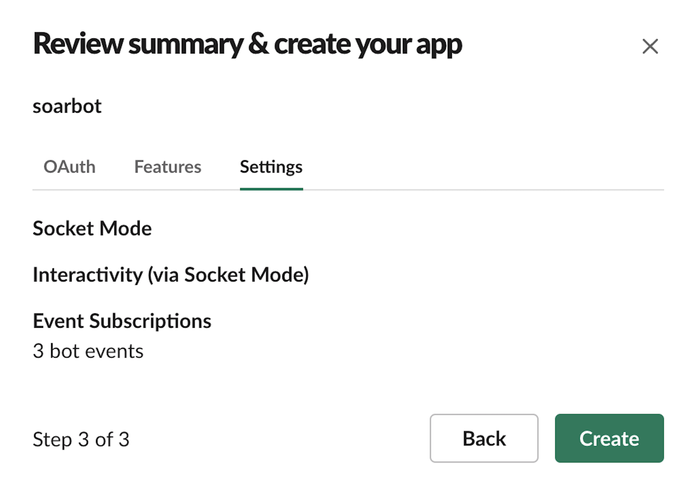
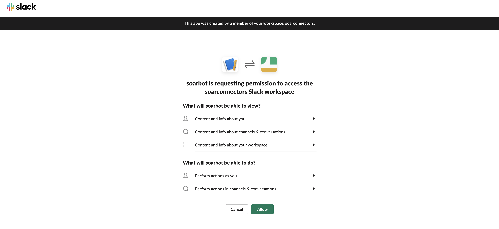
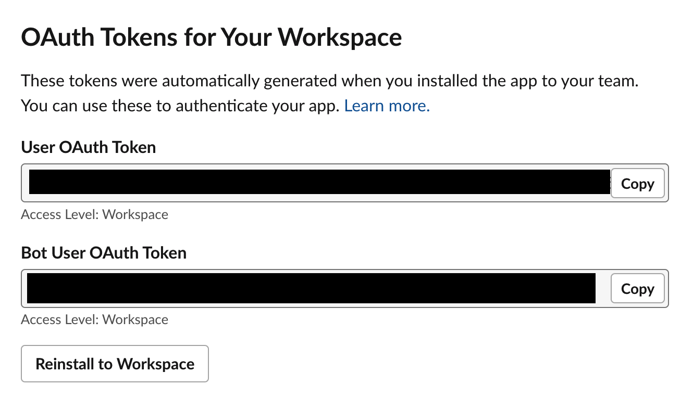
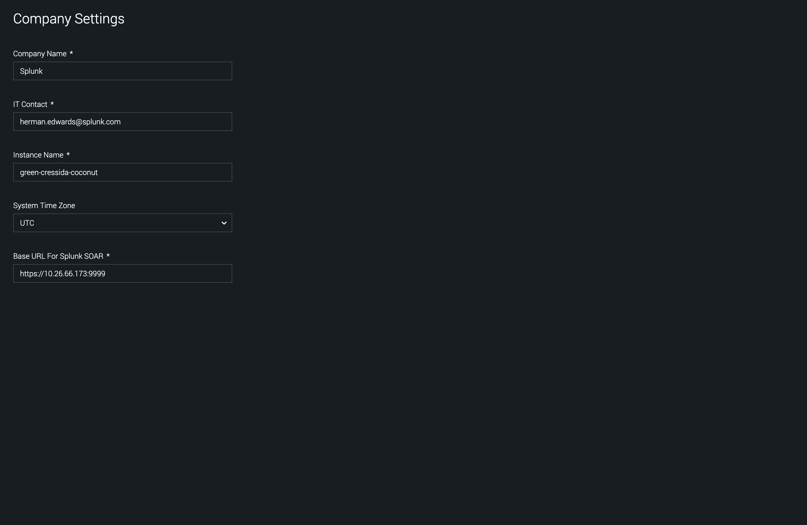
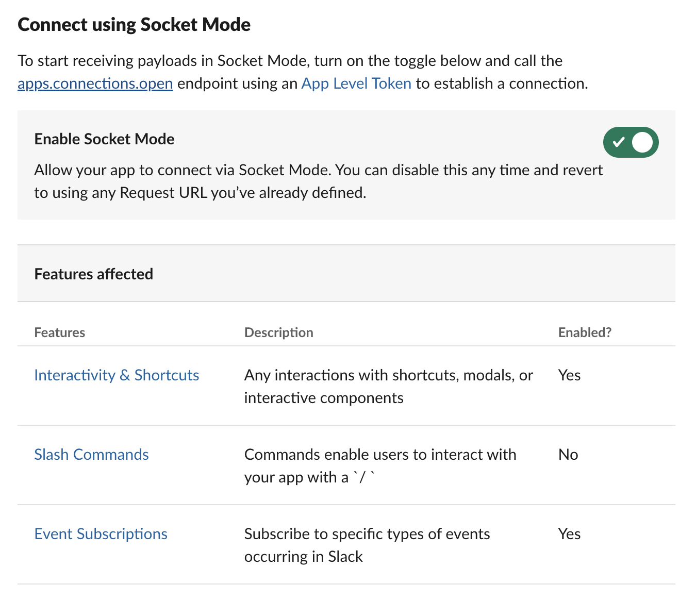
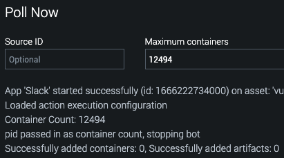

[comment]: # "Auto-generated SOAR connector documentation"
# Slack

Publisher: Splunk  
Connector Version: 2.7.1  
Product Vendor: Slack Technologies  
Product Name: Slack  
Product Version Supported (regex): ".\*"  
Minimum Product Version: 6.2.1  

Integrate with Slack to post messages and attachments to channels

[comment]: # " File: README.md"
[comment]: # "  Copyright (c) 2016-2023 Splunk Inc."
[comment]: # ""
[comment]: # "  Licensed under Apache 2.0 (https://www.apache.org/licenses/LICENSE-2.0.txt)"
[comment]: # ""
## Playbook Backward Compatibility

-   The existing action parameters have been modified for the actions given below. Hence, it is
    requested to the end-user to please update their existing playbooks by re-inserting | modifying
    | deleting the corresponding action blocks or by providing appropriate values to these action
    parameters to ensure the correct functioning of the playbooks created on the earlier versions of
    the app.

      

    -   Upload File - 4 new action parameters 'filename', 'content', 'parent_message_ts' and
        'filetype' are added which helps to add the file without specifying vault ID in 'file'
        parameter. The 'parent_message_ts' can be used to reply in the thread based on the timestamp
        of the parent message.

    <!-- -->

    -   Send Message - 2 new action parameters 'reply_broadcast' and 'parent_message_ts' are added
        which can be used to reply in the thread based on the timestamp of the parent message.

    <!-- -->

    -   Send Message - 1 new action parameter 'blocks' is added which can be used to send richly
        formatted "blocks" as Slack messages. See [Slack
        Documentation](https://api.slack.com/messaging/composing/layouts#adding-blocks) for more
        information.

-   New action 'Add Reaction' has been added. Hence, it is requested to the end-user to please
    update their existing playbooks by inserting the corresponding action blocks for this action on
    the earlier versions of the app.

## Authentication

SOAR's Slack App needs a bot token to read messages from and post messages to slack channels. The
app also needs a verification token to verify POST requests received from Slack.

### Steps for Creating a Slack App Using App Manifest File (Recommended)

App manifest file in (.yaml):  
  
Use below manifest file for creating slack app.  
  

    display_information:
      name: soarbot
    features:
      bot_user:
        display_name: soarbot
        always_online: false
    oauth_config:
      scopes:
        user:
          - channels:write
          - groups:write
          - im:write
          - mpim:write
          - channels:read
          - groups:read
          - im:read
          - mpim:read
          - users:read
          - users:read.email
          - chat:write
          - reactions:write
          - files:write
        bot:
          - channels:manage
          - groups:write
          - im:write
          - mpim:read
          - mpim:write
          - channels:read
          - groups:read
          - im:read
          - users:read
          - users:read.email
          - chat:write
          - reactions:write
          - files:write
          - chat:write.public
          - app_mentions:read
          - channels:history
          - im:history
    settings:
      event_subscriptions:
        bot_events:
          - app_mention
          - message.channels
          - message.im
      interactivity:
        is_enabled: true
      org_deploy_enabled: false
      socket_mode_enabled: true
      token_rotation_enabled: false

  
  
Select **From an app manifest** option.  
  
  
  
Select a workspace.  
  
  
  
Paste above manifest file in **yaml** section.  
  
  
  
Click **Next** , then verify all scopes for Bot and User which is added from the manifest file.  
  
  
  
Note that event subscriptions from the manifest file will also be added for the bot. Proceed by
clicking **Create** .  
  
  
  
On the next page, there is a **Verification Token** . This token is needed during asset
configuration.  
  
  
  
On the same page, there is an **App Level tokens** section. Click on the **Generate Token and
Scope** button. You will then be prompted to provide a token name, for example, **socket_token** .
Just below this is the **Add Scope** button. Add **connection:write & authorization:read** and click
on **Generate** . This token is needed during asset configuration.  
  
  
  
On the same page under the **Install your app** section, click **Install to Workspace** .  
  
  
  
On the next page, click **Allow** .  
  
  
  
After authorizing the app, in the menu bar on the left, select **OAuth & Permissions** . The **Bot
User OAuth Token** and **User OAuth Token** are required during asset configuration.  
  
  
  
On the same page, scroll down to the **Scopes** section and verify the scopes for Bot and User added
from the manifest file.  
  

### Steps for Creating a Slack App From Scratch

Creating a Slack App is required to get the proper bot token for authenticating the SOAR Slack App.
To do this, go to <https://api.slack.com/apps> in a browser, and select **Create New App** .  
  
  
  
In the pop up window, there are two options, select **From scratch** .This would open another pop
up, give the app name and associate it with a Slack team/your Workspace, then click **Create App**
.  
  
  
  
On the next page, there is a **Verification Token** . This token is needed during asset
configuration.  
  
  
  
On the same page, there is an **App Level tokens** section. Click on the **Generate Token and
Scope** button. You will then be prompted to provide a token name, for example, **socket_token** .
Just below this is the **Add Scope** button. Add **connection:write & authorization:read** and click
on **Generate** . This token is needed during asset configuration.  
  
  
  
In the menu bar on the left, select **OAuth & Permissions** . On that page, Scroll down to the
**Scopes** section and click **Add an OAuth Scope** to add scopes to your **Bot Token** and **User
Token** .  
  
  
  
The required scopes are given below, please add the particular scope to use that specific action.  
  

<table>
<colgroup>
<col style="width: 33%" />
<col style="width: 33%" />
<col style="width: 33%" />
</colgroup>
<thead>
<tr class="header">
<th>Required Action Scopes</th>
<th></th>
<th></th>
</tr>
</thead>
<tbody>
<tr class="odd">
<th>Action Name</th>
<th>Bot Token Scopes</th>
<th>User Token Scopes</th>
</tr>

<tr class="odd">
<td>Create Channel</td>
<td><ul>
<li>channels:manage</li>
<li>groups:write</li>
<li>im:write</li>
<li>mpim:write</li>
</ul></td>
<td><ul>
<li>channels:write</li>
<li>groups:write</li>
<li>im:write</li>
<li>mpim:write</li>
</ul></td>
</tr>
<tr class="even">
<td>List Channels</td>
<td><ul>
<li>channels:read</li>
<li>groups:read</li>
<li>im:read</li>
<li>mpim:read</li>
</ul></td>
<td><ul>
<li>channels:read</li>
<li>groups:read</li>
<li>im:read</li>
<li>mpim:read</li>
</ul></td>
</tr>
<tr class="odd">
<td>List Users</td>
<td><ul>
<li>users:read</li>
<li>users:read.email</li>
</ul></td>
<td><ul>
<li>users:read</li>
<li>users:read.email</li>
</ul></td>
</tr>
<tr class="even">
<td>Get User</td>
<td><ul>
<li>users:read</li>
<li>users:read.email</li>
</ul></td>
<td><ul>
<li>users:read</li>
<li>users:read.email</li>
</ul></td>
</tr>
<tr class="odd">
<td>Invite User</td>
<td><ul>
<li>channels:manage</li>
<li>groups:write</li>
<li>im:write</li>
<li>mpim:write</li>
</ul></td>
<td><ul>
<li>channels:write</li>
<li>groups:write</li>
<li>im:write</li>
<li>mpim:write</li>
</ul></td>
</tr>
<tr class="even">
<td>Send Message</td>
<td><ul>
<li>chat:write</li>
</ul></td>
<td><ul>
<li>chat:write</li>
</ul></td>
</tr>
<tr class="odd">
<td>Add Reaction</td>
<td><ul>
<li>reactions:write</li>
</ul></td>
<td><ul>
<li>reactions:write</li>
</ul></td>
</tr>
<tr class="even">
<td>Upload File</td>
<td><ul>
<li>files:write</li>
</ul></td>
<td><ul>
<li>files:write</li>
</ul></td>
</tr>
<tr class="odd">
<td>Ask Question/Ask Question Channel</td>
<td><ul>
<li>chat:write</li>
<li>chat:write.public</li>
</ul></td>
<td><ul>
<li>chat:write</li>
</ul></td>
</tr>
</tbody>
</table>

NOTE: **chat:write** replaces both **chat:write:user** and **chat:write:bot** and **files:write**
replaces both **files:write:user** and **files:write:bot**  
  
Next, click on **Install App** in the side bar. On that page, click **Install to Workspace** .  
  
  
  
On the next page, click **Allow** .  
  
  
  
After authorizing the app, in the menu bar on the left, select **OAuth & Permissions** . The **Bot
User OAuth Token** and **User OAuth Token** are required during asset configuration.  
  

## SOAR Base URL

The app uses the SOAR **Base URL** configuration to generate links to actions, so please make sure a
valid url is specified in the **System Settings** .  
  
  
  
NOTE: If the PORT is other than 443, please add the port in the **BASE URL For Splunk SOAR**
field.  
  

## [SOAR Slack Asset](img/slack_system_settings_with_port.png)

[Fill out the required values in the **Asset Definition** tab.  
  
](img/slack_system_settings_with_port.png)
  
  
Fill out the **Bot User OAuth Token** , **User OAuth Token** , **Socket Token** and **Verification
Token** in the **Asset Settings** tab. Optionally specify permissions and authorized Member IDs if
you intend to use SlackBot features. Also, anytime you update the any of the tokens mentioned above,
please stop the bot once and restart the on poll to reflect the latest changes.  
  
**IMPORTANT NOTE:** if you modify the "Permit" check boxes or permitted users options (SlackBot
permissions) after asset creation, you will need to run POLL NOW with Maximum containers set to 1234
to restart the bot. Alternatively, you can stop and restart the bot.  
  
  
  
Click **SAVE** , you will be asked to fill in the **Ingest Settings** , select one of the labels
from the drop-down or you can create a new one and Click **SAVE** .  
  
  
  

### Automation User

The Slack app needs a SOAR authentication token to perform some tasks on the SOAR platform. To get
this token, it is recommended that you create a new automation user. The steps for creating this
user are as follows:

-   On the SOAR platform, navigate to **Administration->User Management**

-   Under **Users** , click **+ USER**

-   In the **Add User** wizard, do the following:

      

    -   Set the **User Type** to **Automation**
    -   Give the user a **Username** like "Slack Automation"
    -   For security reasons, accessing 127.0.0.1 is not allowed. Set **Allowed IPs** same as the
        **instance IP or "any"** . (eg : If instance IP is 10.1.18.123, set allowed IP also
        10.1.18.123)
    -   Set the **Default Label** to the label seen in the Slack asset's **Ingest Settings**
    -   Under **Roles** , in addition to the default **Automation** role, add the **Observer** role
    -   Click **CREATE**

      
      

-   Once the new user is created, click on the user in the user list

<!-- -->

-   On the user's page copy the **ph-auth-token** field from the **Authorization Configuration for
    REST API** box

      
      
      

-   Paste the copied token in the **Automation User Auth Token** on the Slack app's **Asset
    Settings** page

### Test Connectivity

Now, on the **Asset Settings** page, click the **TEST CONNECTIVITY** button, which will display a
text box with progress messages. It will show the bot username and bot user ID that SOAR received
from Slack. Please ensure that these are correct.  
  

## Set up Interactivity in Slack

Go to the **Your apps** option in Slack. From the menu on the left select the **Interactivity &
Shortcuts** option.  
  
NOTE: Slack will only send POST requests to endpoints that have an SSL certificate signed by a
certificate authority.  
  
  
  
Once on this page, toggle on **Interactivity** . Configure the **Request URL** . To do so just copy
the value of url provided in the field **POST incoming for Slack to this location** in **Asset
Settings** of slack asset and paste it in the **Request URL** field of **Slack Apps** .  
  
  
  
NOTE : Slack Apps provided two ways to handle interactions on their apps, using **Request URL** and
**WebSockets** .At a time only one mode can be used, either Request URL or Socoket mode. The Slack
Bot uses web sockets internally, there it is suggested to make to assests for using slack actions
and bot simultaneously. One asset to perform slack actions from phantom and another asset to use
commands on slack for phantom. Using one asset for both can cause issue.  
  

## Set up Socket Mode in Slack

Go to the **Your apps** option in Slack. From the menu on the left select the **Socket Mode**
option.  
  
  
  
Once on this page, toggle on **Socket Mode** . Then click on the event subscription option. This
will redirect you to the Event Subscription page, and add the following subscriptions for bot.  
  
  
  
Note: When socket mode is enabled, click on **Interactivity & Shortcuts** on the left menu bar and
verify that the **Request URL** field is empty in the **Interactivity** section.  
  
  
  

## Slack Bot

### Ingest Settings

To run the SOAR SlackBot that will get SOAR to take commands from Slack, ingestion needs to be
enabled on the SOAR Slack Asset. To do this go back to the INGEST SETTINGS tab and enable polling
and specify the Polling interval as **off** . The "Label to apply to objects from this source"
setting is ignored by this app, so it can be set to anything.  
  
  
  
To check the status of the SOAR bot and restart it if not running, you can Click POLL NOW from the
INGEST SETTINGS app and then POLL NOW again. The "Source ID", "Maximum containers", and "Maximum
artifacts" settings can be ignored in this case.  
  
  
  
The POLL NOW window will display the PID of the SlackBot process as well as the number of artifacts
and containers ingested (which will always be zero for this app).  
  

### Restarting SlackBot

If SlackBot permissions are changed in the asset configuration, it is mandatory to restart SlackBot
for the new settings to go into affect. To restart SlackBot, use the POLL NOW option with a Maximum
container count of 1234.  
  
  
  
  

### Stopping SlackBot

Once the SOAR SlackBot starts running, the **stop bot** action needs to be run to stop it. Simply
disabling ingestion won't stop SlackBot. You may also run poll now with a Maximum container count of
the PID to stop SlackBot. To obtain the PID, run Poll Now with default parameters.  
  
WARNING: Stopping SlackBot is required before upgrading or uninstalling the SOAR Slack App or else
an untracked SlackBot process may be left running on the SOAR instance. In addition, deleting a
Slack asset that has SlackBot running will result in SlackBot continuing to run, untracked.  
  
  
  

## Slack Commands

Once a Slack asset has been configured, and SlackBot is running on SOAR, it needs to be invited to
the channel, and then commands from Slack can be received by SOAR. In Slack, just mention the bot to
get a help message on running commands. All commands follow this syntax:  
  

@BOT_NAME COMMAND COMMAND_PARAMETERS

  

### SlackBot Permissions

Granular permissions that control who, and what actions can be performed by SOAR SlackBot can be
defined in the asset configuration.

-   Permit 'act' commands on Bot (Boolean)

      

    -   Allow SlackBot commands that leverage the "act" operator
    -   Example: @SOARbot act 'list channels' --container 123 --asset slack

-   Permit 'run_playbook' commands on Bot (Boolean)

      

    -   Allow playbooks to be run on specific containers through SlackBot
    -   Example: @SOARbot run_playbook \<playbook_id> \<container_id>

-   Permit 'get_container' commands on Bot (Boolean)

      

    -   Allow SlackBot to obtain information about a specified container
    -   Example: @SOARbot get_container )

-   Permit 'list' commands on Bot (Boolean)

      

    -   Allow SlackBot commands that leverage the "list" operator
    -   Example: @SOARbot list \[actions|containers\]

-   Users permitted to use Bot Actions

      

    -   Provide Comma separated list of Member IDs to be permitted to use SlackBot commands. If left
        blank, all users will be permitted (default setting)
    -   Example: U01M3CLBL9Q, U01M4CLAP9M (NOTE: You must use the unique Member ID and not the
        username)

  

### Running Actions

To run an action on SOAR from Slack, use the **act** command. The syntax of which is:  
  

    @BOT_NAME act ACTION_NAME [--container CONTAINER_ID] [--asset ASSET] [--name NAME]
        [--type TYPE] [--parameters PARAMETER:VALUE [PARAMETER:VALUE]*]

    required parameters:
      ACTION_NAME       The name of the action to run on SOAR
      --container       ID of the container to run the action on

    optional parameters:
      --name            Set a name for the action (defaults to 'Slack generated action')
      --type            Set the type of the action (defaults to 'SOARbot')
      --asset           Name or ID of the asset to run the action on
                        If no asset is specified, the given action will run on all possible assets
      --parameters      List of parameter/value pairs in the format
                        param1:value1 param2:value2...

    examples:
      To run the action "list channels" on container 123 using the "slack" asset:

        @SOARbot act "list channels" --container 123 --asset slack

      To run the action "whois ip" on 1.1.1.1 using the "whois" asset:

        @SOARbot act "whois ip" --container 123 --asset whois --parameters ip:1.1.1.1

      To run all possible "whois ip" actions on 1.1.1.1 using all assets that support the action, and giving it the name "All WhoIs":

        @SOARbot act "whois ip" --container 123 --parameters ip:1.1.1.1 --name "All WhoIs"

  
After receiving an **act** command, SlackBot will kick off the action and send a link to the action
page to Slack. When the action is complete, SlackBot will send a summary of the action results to
Slack. If multiple actions are run at once, SlackBot will send action results for each action
separately as each action completes.  

### Running Playbooks

To run a playbook on SOAR from Slack, use the **run_playbook** command. The syntax of which is:  
  

    @BOT_NAME run_playbook [--repo REPO] PLAYBOOK CONTAINER_ID

    required parameters:
      PLAYBOOK          Name or ID of the playbook to run
      CONTAINER_ID      ID of container to run the playbook on

    optional parameters:
      --repo REPO       Name of the repo the playbook is in (required if the
                        playbook argument is a name and not an ID)"

    examples:
      To run the playbook "investigate" which is in the "community" repo, on container 123

        @SOARbot run_playbook --repo community investigate 123

      To run the playbook with ID 32 on container 123:

        @SOARbot run_playbook 32 123

  
After receiving a **run_playbook** command, SlackBot will kick off the playbook and send a link to
the container's mission control page to slack. When the playbook has finished running, SlackBot will
send a status report of the playbook's run to Slack.  

### Getting Container Information

To get information about a container, use the **get_container** command. The syntax of which is:  
  

    @BOT_NAME get_container [--container CONTAINER] [--tags TAG [TAG]*]

    parameters:
      --container       ID of the container to retrieve
      --tags            List of tags of containers to retrieve

    Only one of --container or --tags flags can be included at once
    Using the --tags flag will return a small summary of containers with the given tag.

    examples:
      To get information on container 123:

        @SOARbot get_container 123

      To get a list of containers with the tag "my_tag"

        @SOARbot get_container --tags my_tag

      To get a list of containers with one of the following tags: "tag1" "tag2" or "tag3"

        @SOARbot get_container --tags tag1 tag2 tag3

Running a **get_container** command will result in SlackBot sending either a list of containers or a
set of information on one container to Slack.  

### Listing Actions or Containers

To get a list of actions or containers, use the **list** command. The syntax of which is:  
  

    @BOT_NAME list [actions|containers]

    parameters:
      object        name of an object to list can be 'actions' or 'containers'

    WARNING: If there are many containers on the system, the 'list containers' command can take a long time and can result in a lot of data being dumped on Slack

    examples:
      To get a list of all actions on the SOAR instance:

        @SOARbot list actions

      To get a list of all containers on the SOAR instance:

        @SOARbot list containers

Running a **list** command will result in SlackBot sending a list of either actions or containers to
Slack.  

### Configuration Variables
The below configuration variables are required for this Connector to operate.  These variables are specified when configuring a Slack asset in SOAR.

VARIABLE | REQUIRED | TYPE | DESCRIPTION
-------- | -------- | ---- | -----------
**bot_token** |  required  | password | Bot User OAuth Token
**verification_token** |  required  | password | Verification Token
**user_token** |  optional  | password | User OAuth Token
**socket_token** |  optional  | password | Socket Token
**ph_auth_token** |  optional  | password | Automation User Auth Token
**timeout** |  optional  | numeric | Question timeout (in minutes)
**response_poll_interval** |  optional  | numeric | How often to poll for a response (in seconds)
**permit_bot_act** |  optional  | boolean | Permit 'act' commands on Bot (I.E. @SOARbot act 'list channels' --container 123 --asset slack)
**permit_bot_playbook** |  optional  | boolean | Permit 'run_playbook' commands on Bot (I.E. @SOARbot run_playbook <playbook_id> <container_id>)
**permit_bot_container** |  optional  | boolean | Permit 'get_container' commands on Bot (I.E. @SOARbot get_container <container_id>)
**permit_bot_list** |  optional  | boolean | Permit 'list' commands on Bot (I.E. @SOARbot list [actions|containers])
**permitted_bot_users** |  optional  | string | Users permitted to use Bot Actions. Comma seperated list of Member IDs. Leave blank to allow all users (Default Setting)

### Supported Actions  
[test connectivity](#action-test-connectivity) - Tests authorization with Slack  
[create channel](#action-create-channel) - Create a new Slack channel  
[list channels](#action-list-channels) - List public channels of a Slack team  
[list users](#action-list-users) - List users of a Slack team  
[get user](#action-get-user) - Get information about a user of a Slack team  
[invite users](#action-invite-users) - Invite user(s) to a Slack channel  
[send message](#action-send-message) - Send a message to Slack  
[add reaction](#action-add-reaction) - React to a message in Slack  
[upload file](#action-upload-file) - Upload file to Slack  
[ask question](#action-ask-question) - Ask a question to a Slack user  
[ask question channel](#action-ask-question-channel) - Ask a question in slack channel  
[get response](#action-get-response) - Get the response to a previously asked question  
[on poll](#action-on-poll) - Start SlackBot and make health checks to it  
[stop bot](#action-stop-bot) - Stop SlackBot  

## action: 'test connectivity'
Tests authorization with Slack

Type: **test**  
Read only: **True**

Checks that the provided bot token is valid and grabs information about the configured bot user.

#### Action Parameters
No parameters are required for this action

#### Action Output
No Output  

## action: 'create channel'
Create a new Slack channel

Type: **generic**  
Read only: **False**

To create a private channel, use the 'channel_type' selection parameter. This action requires a User OAuth Token defined in the asset. For naming conventions, see https://api.slack.com/methods/conversations.create.

#### Action Parameters
PARAMETER | REQUIRED | DESCRIPTION | TYPE | CONTAINS
--------- | -------- | ----------- | ---- | --------
**name** |  required  | Name of channel | string | 
**channel_type** |  optional  | Type of channel to create (public or private) | string | 

#### Action Output
DATA PATH | TYPE | CONTAINS | EXAMPLE VALUES
--------- | ---- | -------- | --------------
action_result.status | string |  |   success  failed 
action_result.parameter.channel_type | string |  |   public 
action_result.parameter.name | string |  |   name 
action_result.data.\*.channel.context_team_id | string |  |   T02Q675CX6W 
action_result.data.\*.channel.created | numeric |  |   1595502058 
action_result.data.\*.channel.creator | string |  |   UEVKZ9ZLL 
action_result.data.\*.channel.id | string |  |   C017K3XMNTF 
action_result.data.\*.channel.is_archived | boolean |  |   True  False 
action_result.data.\*.channel.is_channel | boolean |  |   True  False 
action_result.data.\*.channel.is_ext_shared | boolean |  |   True  False 
action_result.data.\*.channel.is_general | boolean |  |   True  False 
action_result.data.\*.channel.is_group | boolean |  |   True  False 
action_result.data.\*.channel.is_im | boolean |  |   True  False 
action_result.data.\*.channel.is_member | boolean |  |   True  False 
action_result.data.\*.channel.is_moved | numeric |  |   0 
action_result.data.\*.channel.is_mpim | boolean |  |   True  False 
action_result.data.\*.channel.is_open | boolean |  |   True  False 
action_result.data.\*.channel.is_org_shared | boolean |  |   True  False 
action_result.data.\*.channel.is_pending_ext_shared | boolean |  |   True  False 
action_result.data.\*.channel.is_private | boolean |  |   True  False 
action_result.data.\*.channel.is_shared | boolean |  |   True  False 
action_result.data.\*.channel.last_read | string |  |   0000000000.000000 
action_result.data.\*.channel.name | string |  `slack channel name`  |   name 
action_result.data.\*.channel.name_normalized | string |  |   name 
action_result.data.\*.channel.parent_conversation | string |  |  
action_result.data.\*.channel.priority | numeric |  |   0 
action_result.data.\*.channel.purpose.creator | string |  |  
action_result.data.\*.channel.purpose.last_set | numeric |  |   0 
action_result.data.\*.channel.purpose.value | string |  |  
action_result.data.\*.channel.shared_team_ids | string |  |   TEW1DJ485 
action_result.data.\*.channel.topic.creator | string |  |  
action_result.data.\*.channel.topic.last_set | numeric |  |   0 
action_result.data.\*.channel.topic.value | string |  |  
action_result.data.\*.channel.unlinked | numeric |  |   0 
action_result.data.\*.channel.updated | numeric |  |   1683204339510 
action_result.data.\*.ok | boolean |  |   True  False 
action_result.data.\*.response_metadata.warnings | string |  |   missing_charset 
action_result.data.\*.warning | string |  |   missing_charset 
action_result.summary | string |  |  
action_result.message | string |  |   Channel created successfully 
summary.total_objects | numeric |  |   1 
summary.total_objects_successful | numeric |  |   1   

## action: 'list channels'
List public channels of a Slack team

Type: **investigate**  
Read only: **True**

The output of this action is a list of all public channels in the configured Slack team. The channels will be listed with their corresponding channel IDs.

#### Action Parameters
PARAMETER | REQUIRED | DESCRIPTION | TYPE | CONTAINS
--------- | -------- | ----------- | ---- | --------
**limit** |  optional  | Specify the maximum number of results to return. Default is 100 | numeric | 

#### Action Output
DATA PATH | TYPE | CONTAINS | EXAMPLE VALUES
--------- | ---- | -------- | --------------
action_result.status | string |  |   success  failed 
action_result.parameter.limit | numeric |  |   1000 
action_result.data.\*.channels.\*.context_team_id | string |  |   T02Q675CX6W 
action_result.data.\*.channels.\*.created | numeric |  |   1545061069 
action_result.data.\*.channels.\*.creator | string |  |   UEVKZ9ZLL 
action_result.data.\*.channels.\*.id | string |  `slack channel id`  |  
action_result.data.\*.channels.\*.is_archived | boolean |  |   True  False 
action_result.data.\*.channels.\*.is_channel | boolean |  |   True  False 
action_result.data.\*.channels.\*.is_ext_shared | boolean |  |   True  False 
action_result.data.\*.channels.\*.is_general | boolean |  |   True  False 
action_result.data.\*.channels.\*.is_group | boolean |  |   True  False 
action_result.data.\*.channels.\*.is_im | boolean |  |   True  False 
action_result.data.\*.channels.\*.is_member | boolean |  |   True  False 
action_result.data.\*.channels.\*.is_moved | numeric |  |   0 
action_result.data.\*.channels.\*.is_mpim | boolean |  |   True  False 
action_result.data.\*.channels.\*.is_org_shared | boolean |  |   True  False 
action_result.data.\*.channels.\*.is_pending_ext_shared | boolean |  |   True  False 
action_result.data.\*.channels.\*.is_private | boolean |  |   True  False 
action_result.data.\*.channels.\*.is_shared | boolean |  |   True  False 
action_result.data.\*.channels.\*.members | string |  |  
action_result.data.\*.channels.\*.name | string |  `slack channel name`  |  
action_result.data.\*.channels.\*.name_normalized | string |  |   general 
action_result.data.\*.channels.\*.num_members | numeric |  |   23 
action_result.data.\*.channels.\*.parent_conversation | string |  |  
action_result.data.\*.channels.\*.purpose.creator | string |  |   UEVKZ9ZLL 
action_result.data.\*.channels.\*.purpose.last_set | numeric |  |   1545061069 
action_result.data.\*.channels.\*.purpose.value | string |  |   This channel is for workspace-wide communication and announcements. All members are in this channel. 
action_result.data.\*.channels.\*.topic.creator | string |  |   UEVKZ9ZLL 
action_result.data.\*.channels.\*.topic.last_set | numeric |  |   1545061069 
action_result.data.\*.channels.\*.topic.value | string |  |   Non-work banter and water cooler conversation 
action_result.data.\*.channels.\*.unlinked | numeric |  |   0 
action_result.data.\*.channels.\*.updated | numeric |  |   1639075392157 
action_result.data.\*.ok | boolean |  |   True  False 
action_result.data.\*.response_metadata.next_cursor | string |  |   dGVhbTpDMDE3WENOQVE4TA== 
action_result.summary | string |  |  
action_result.summary.num_public_channels | numeric |  |   10 
action_result.message | string |  |   Num public channels: 100 
summary.total_objects | numeric |  |   1 
summary.total_objects_successful | numeric |  |   1   

## action: 'list users'
List users of a Slack team

Type: **investigate**  
Read only: **True**

#### Action Parameters
PARAMETER | REQUIRED | DESCRIPTION | TYPE | CONTAINS
--------- | -------- | ----------- | ---- | --------
**limit** |  optional  | Specify the maximum number of results to return. Default is 100 | numeric | 

#### Action Output
DATA PATH | TYPE | CONTAINS | EXAMPLE VALUES
--------- | ---- | -------- | --------------
action_result.status | string |  |   success  failed 
action_result.parameter.limit | numeric |  |   1000 
action_result.data.\*.cache_ts | numeric |  |  
action_result.data.\*.members.\*.color | string |  |  
action_result.data.\*.members.\*.deleted | boolean |  |   True  False 
action_result.data.\*.members.\*.enterprise_user.enterprise_id | string |  |   E02PYRE04SJ 
action_result.data.\*.members.\*.enterprise_user.enterprise_name | string |  |   Test Soar Sandbox 
action_result.data.\*.members.\*.enterprise_user.id | string |  |   U02QJ5JLTNV 
action_result.data.\*.members.\*.enterprise_user.is_admin | boolean |  |   True  False 
action_result.data.\*.members.\*.enterprise_user.is_owner | boolean |  |   True  False 
action_result.data.\*.members.\*.enterprise_user.is_primary_owner | boolean |  |   True  False 
action_result.data.\*.members.\*.id | string |  `slack user id`  |  
action_result.data.\*.members.\*.is_admin | boolean |  |   True  False 
action_result.data.\*.members.\*.is_app_user | boolean |  |   True  False 
action_result.data.\*.members.\*.is_bot | boolean |  |   True  False 
action_result.data.\*.members.\*.is_email_confirmed | boolean |  |   True  False 
action_result.data.\*.members.\*.is_invited_user | boolean |  |   True  False 
action_result.data.\*.members.\*.is_owner | boolean |  |   True  False 
action_result.data.\*.members.\*.is_primary_owner | boolean |  |   True  False 
action_result.data.\*.members.\*.is_restricted | boolean |  |   True  False 
action_result.data.\*.members.\*.is_ultra_restricted | boolean |  |   True  False 
action_result.data.\*.members.\*.name | string |  `slack user name`  |  
action_result.data.\*.members.\*.profile.always_active | boolean |  |   True  False 
action_result.data.\*.members.\*.profile.api_app_id | string |  |   AEVNKT17D 
action_result.data.\*.members.\*.profile.avatar_hash | string |  |   g6f8c4b87d3e 
action_result.data.\*.members.\*.profile.bot_id | string |  |   BEV82RKAM 
action_result.data.\*.members.\*.profile.display_name | string |  |   Slackbot 
action_result.data.\*.members.\*.profile.display_name_normalized | string |  |   Slackbot 
action_result.data.\*.members.\*.profile.email | string |  `email`  |   slackbot@test.com 
action_result.data.\*.members.\*.profile.fields | string |  |  
action_result.data.\*.members.\*.profile.first_name | string |  |   slackbot 
action_result.data.\*.members.\*.profile.image_1024 | string |  `url`  |   https://a.slack-edge.com/80588/img/slackbot_1024.png 
action_result.data.\*.members.\*.profile.image_192 | string |  `url`  |   https://a.slack-edge.com/80588/img/slackbot_192.png 
action_result.data.\*.members.\*.profile.image_24 | string |  `url`  |   https://a.slack-edge.com/80588/img/slackbot_24.png 
action_result.data.\*.members.\*.profile.image_32 | string |  `url`  |   https://a.slack-edge.com/80588/img/slackbot_32.png 
action_result.data.\*.members.\*.profile.image_48 | string |  `url`  |   https://a.slack-edge.com/80588/img/slackbot_48.png 
action_result.data.\*.members.\*.profile.image_512 | string |  `url`  |   https://a.slack-edge.com/80588/img/slackbot_512.png 
action_result.data.\*.members.\*.profile.image_72 | string |  `url`  |   https://a.slack-edge.com/80588/img/slackbot_72.png 
action_result.data.\*.members.\*.profile.image_original | string |  `url`  |  
action_result.data.\*.members.\*.profile.is_custom_image | boolean |  |   True  False 
action_result.data.\*.members.\*.profile.last_name | string |  |   Slackbot 
action_result.data.\*.members.\*.profile.phone | string |  |  
action_result.data.\*.members.\*.profile.real_name | string |  |   Slackbot 
action_result.data.\*.members.\*.profile.real_name_normalized | string |  |   Slackbot 
action_result.data.\*.members.\*.profile.skype | string |  |  
action_result.data.\*.members.\*.profile.status_emoji | string |  |  
action_result.data.\*.members.\*.profile.status_expiration | numeric |  |   0 
action_result.data.\*.members.\*.profile.status_text | string |  |  
action_result.data.\*.members.\*.profile.status_text_canonical | string |  |  
action_result.data.\*.members.\*.profile.team | string |  |   TEW1DJ485 
action_result.data.\*.members.\*.profile.title | string |  |  
action_result.data.\*.members.\*.profile.who_can_share_contact_card | string |  |   NO_ONE 
action_result.data.\*.members.\*.real_name | string |  |   Test Invite Bot 
action_result.data.\*.members.\*.team_id | string |  |   TEW1DJ485 
action_result.data.\*.members.\*.tz | string |  |   America/Los_Angeles 
action_result.data.\*.members.\*.tz_label | string |  |   Pacific Standard Time 
action_result.data.\*.members.\*.tz_offset | numeric |  |   -28800 
action_result.data.\*.members.\*.updated | numeric |  |   1569140077 
action_result.data.\*.members.\*.who_can_share_contact_card | string |  |   EVERYONE 
action_result.data.\*.ok | boolean |  |   True  False 
action_result.data.\*.response_metadata.next_cursor | string |  |  
action_result.summary.num_users | numeric |  |   28 
action_result.message | string |  |   Num users: 28 
summary.total_objects | numeric |  |   1 
summary.total_objects_successful | numeric |  |   1   

## action: 'get user'
Get information about a user of a Slack team

Type: **investigate**  
Read only: **True**

This action will ignore email_address parameter when user_id parameter is provided.

#### Action Parameters
PARAMETER | REQUIRED | DESCRIPTION | TYPE | CONTAINS
--------- | -------- | ----------- | ---- | --------
**user_id** |  optional  | Unique ID of user to get info of | string |  `slack user id` 
**email_address** |  optional  | Email address of user to get info of. Will not be used if User ID is specified | string |  `email` 

#### Action Output
DATA PATH | TYPE | CONTAINS | EXAMPLE VALUES
--------- | ---- | -------- | --------------
action_result.status | string |  |   success  failed 
action_result.parameter.email_address | string |  `email`  |  
action_result.parameter.user_id | string |  `slack user id`  |  
action_result.data.\*.ok | boolean |  |   True  False 
action_result.data.\*.user.color | string |  |   4bbe2e 
action_result.data.\*.user.deleted | boolean |  |   True  False 
action_result.data.\*.user.enterprise_user.enterprise_id | string |  |   E02PYRE04SJ 
action_result.data.\*.user.enterprise_user.enterprise_name | string |  |   Test Soar Sandbox 
action_result.data.\*.user.enterprise_user.id | string |  |   U03DU1BA9ML 
action_result.data.\*.user.enterprise_user.is_admin | boolean |  |   True  False 
action_result.data.\*.user.enterprise_user.is_owner | boolean |  |   True  False 
action_result.data.\*.user.enterprise_user.is_primary_owner | boolean |  |   True  False 
action_result.data.\*.user.id | string |  `slack user id`  |   UEV44MD9N 
action_result.data.\*.user.is_admin | boolean |  |   True  False 
action_result.data.\*.user.is_app_user | boolean |  |   True  False 
action_result.data.\*.user.is_bot | boolean |  |   True  False 
action_result.data.\*.user.is_email_confirmed | boolean |  |   True  False 
action_result.data.\*.user.is_owner | boolean |  |   True  False 
action_result.data.\*.user.is_primary_owner | boolean |  |   True  False 
action_result.data.\*.user.is_restricted | boolean |  |   True  False 
action_result.data.\*.user.is_ultra_restricted | boolean |  |   True  False 
action_result.data.\*.user.name | string |  `slack user name`  |   @testinvite-noreply 
action_result.data.\*.user.profile.always_active | boolean |  |   True  False 
action_result.data.\*.user.profile.api_app_id | string |  |   A017K8386N9 
action_result.data.\*.user.profile.avatar_hash | string |  |   g6f8c4b87d3e 
action_result.data.\*.user.profile.bot_id | string |  |   B017LK9BYTC 
action_result.data.\*.user.profile.display_name | string |  |   Slackbot 
action_result.data.\*.user.profile.display_name_normalized | string |  |   Slackbot 
action_result.data.\*.user.profile.email | string |  `email`  |   slackbot@test.com 
action_result.data.\*.user.profile.fields | string |  |  
action_result.data.\*.user.profile.first_name | string |  |   Slackbot 
action_result.data.\*.user.profile.image_192 | string |  `url`  |   https://a.slack-edge.com/80588/img/slackbot_192.png 
action_result.data.\*.user.profile.image_24 | string |  `url`  |   https://a.slack-edge.com/80588/img/slackbot_24.png 
action_result.data.\*.user.profile.image_32 | string |  `url`  |   https://a.slack-edge.com/80588/img/slackbot_32.png 
action_result.data.\*.user.profile.image_48 | string |  `url`  |   https://a.slack-edge.com/80588/img/slackbot_48.png 
action_result.data.\*.user.profile.image_512 | string |  `url`  |   https://a.slack-edge.com/80588/img/slackbot_512.png 
action_result.data.\*.user.profile.image_72 | string |  `url`  |   https://a.slack-edge.com/80588/img/slackbot_72.png 
action_result.data.\*.user.profile.is_custom_image | boolean |  |   True  False 
action_result.data.\*.user.profile.last_name | string |  |   Slackbot 
action_result.data.\*.user.profile.phone | string |  |  
action_result.data.\*.user.profile.real_name | string |  |   Slackbot 
action_result.data.\*.user.profile.real_name_normalized | string |  |   Test Invite Bot 
action_result.data.\*.user.profile.skype | string |  |  
action_result.data.\*.user.profile.status_emoji | string |  |  
action_result.data.\*.user.profile.status_expiration | numeric |  |   0 
action_result.data.\*.user.profile.status_text | string |  |  
action_result.data.\*.user.profile.status_text_canonical | string |  |  
action_result.data.\*.user.profile.team | string |  |   TEW1DJ485 
action_result.data.\*.user.profile.title | string |  |  
action_result.data.\*.user.real_name | string |  |   Slackbot 
action_result.data.\*.user.team_id | string |  |   TEW1DJ485 
action_result.data.\*.user.tz | string |  |   America/Los_Angeles 
action_result.data.\*.user.tz_label | string |  |   Pacific Standard Time 
action_result.data.\*.user.tz_offset | numeric |  |   -28800 
action_result.data.\*.user.updated | numeric |  |   1569140077 
action_result.data.\*.user.who_can_share_contact_card | string |  |   EVERYONE 
action_result.summary | string |  |  
action_result.message | string |  |   User data successfully retrieved 
summary.total_objects | numeric |  |   1 
summary.total_objects_successful | numeric |  |   1   

## action: 'invite users'
Invite user(s) to a Slack channel

Type: **generic**  
Read only: **False**

Up to 1000 users may be added at one time. This action requires a User OAuth Token defined in the asset. For permissions, see: https://api.slack.com/methods/conversations.invite.

#### Action Parameters
PARAMETER | REQUIRED | DESCRIPTION | TYPE | CONTAINS
--------- | -------- | ----------- | ---- | --------
**channel_id** |  required  | ID of channel | string |  `slack channel id` 
**users** |  required  | Comma-separated list of users (IDs) to invite | string | 

#### Action Output
DATA PATH | TYPE | CONTAINS | EXAMPLE VALUES
--------- | ---- | -------- | --------------
action_result.status | string |  |   success  failed 
action_result.parameter.channel_id | string |  `slack channel id`  |   CLBC12T3R 
action_result.parameter.users | string |  |   U6YJX1H24 
action_result.data.\*.channel.context_team_id | string |  |   T02Q675CX6W 
action_result.data.\*.channel.created | numeric |  |   1562715284 
action_result.data.\*.channel.creator | string |  |   U6ZA4J17F 
action_result.data.\*.channel.id | string |  |   CLBC12T3R 
action_result.data.\*.channel.is_archived | boolean |  |   True  False 
action_result.data.\*.channel.is_channel | boolean |  |   True  False 
action_result.data.\*.channel.is_ext_shared | boolean |  |   True  False 
action_result.data.\*.channel.is_general | boolean |  |   True  False 
action_result.data.\*.channel.is_group | boolean |  |   True  False 
action_result.data.\*.channel.is_im | boolean |  |   True  False 
action_result.data.\*.channel.is_member | boolean |  |   True  False 
action_result.data.\*.channel.is_moved | numeric |  |   0 
action_result.data.\*.channel.is_mpim | boolean |  |   True  False 
action_result.data.\*.channel.is_open | boolean |  |   True  False 
action_result.data.\*.channel.is_org_shared | boolean |  |   True  False 
action_result.data.\*.channel.is_pending_ext_shared | boolean |  |   True  False 
action_result.data.\*.channel.is_private | boolean |  |   True  False 
action_result.data.\*.channel.is_shared | boolean |  |   True  False 
action_result.data.\*.channel.last_read | string |  |   1562715284.000200 
action_result.data.\*.channel.name | string |  `slack channel name`  |   channel1 
action_result.data.\*.channel.name_normalized | string |  |   channel1 
action_result.data.\*.channel.parent_conversation | string |  |  
action_result.data.\*.channel.purpose.creator | string |  |  
action_result.data.\*.channel.purpose.last_set | numeric |  |   0 
action_result.data.\*.channel.purpose.value | string |  |  
action_result.data.\*.channel.shared_team_ids | string |  |   T6YGC45LY 
action_result.data.\*.channel.topic.creator | string |  |  
action_result.data.\*.channel.topic.last_set | numeric |  |   0 
action_result.data.\*.channel.topic.value | string |  |  
action_result.data.\*.channel.unlinked | numeric |  |   0 
action_result.data.\*.channel.updated | numeric |  |   1683204116915 
action_result.data.\*.ok | boolean |  |   True  False 
action_result.data.\*.response_metadata.warnings | string |  |   missing_charset 
action_result.data.\*.warning | string |  |   missing_charset 
action_result.summary | string |  |  
action_result.message | string |  |   Invite sent to user(s) 
summary.total_objects | numeric |  |   1 
summary.total_objects_successful | numeric |  |   1   

## action: 'send message'
Send a message to Slack

Type: **generic**  
Read only: **False**

The <b>destination</b> parameter can be a channel ID (e.g. C1A1A1AAA), a channel name (e.g. #general). When sending a message to a channel, the configured bot user must have been added to the channel. Slack recommends limiting messages to 4000 characters but the enforced limit is 40000 characters. Passing a "username" as a channel value is deprecated, along with the whole concept of usernames on Slack. Please always use channel-like IDs instead to make sure your message gets to where it's going.

#### Action Parameters
PARAMETER | REQUIRED | DESCRIPTION | TYPE | CONTAINS
--------- | -------- | ----------- | ---- | --------
**destination** |  required  | Channel (e.g. #channel or C1A1A1AAA) | string |  `slack channel name`  `slack channel id`  `slack user name`  `slack user id` 
**message** |  optional  | Message to send, required if 'blocks' is not set. If 'blocks' is set, this is used as fallback text | string | 
**blocks** |  optional  | Blocks to send, required if 'message' is not set | string | 
**parent_message_ts** |  optional  | Parent message timestamp to reply in thread | string |  `slack message ts` 
**reply_broadcast** |  optional  | Used in conjunction with 'parent_message_ts' and indicates whether reply should be made visible to everyone in the channel or conversation | boolean | 
**link_names** |  optional  | Check this if you want to enable announcements in your Slack messages using mentions. E.g.: Use @someone or @channel in your message in combination with this check to notify people | boolean | 

#### Action Output
DATA PATH | TYPE | CONTAINS | EXAMPLE VALUES
--------- | ---- | -------- | --------------
action_result.status | string |  |   success  failed 
action_result.parameter.blocks | string |  |   [{"type": "section", "text": {"type": "plain_text", "text": "Hello world"}}] 
action_result.parameter.destination | string |  `slack channel name`  `slack channel id`  `slack user name`  `slack user id`  |   #channel_test 
action_result.parameter.link_names | boolean |  |   False  True 
action_result.parameter.message | string |  |   hello world 
action_result.parameter.parent_message_ts | string |  `slack message ts`  |   1653377851.521129 
action_result.parameter.reply_broadcast | boolean |  |   False  True 
action_result.data.\*.channel | string |  `slack channel id`  |  
action_result.data.\*.message.app_id | string |  |   A03B9SMKUS2 
action_result.data.\*.message.blocks.\*.block_id | string |  |   K60o 
action_result.data.\*.message.blocks.\*.elements.\*.elements.\*.channel_id | string |  |   C0183RKACNM 
action_result.data.\*.message.blocks.\*.elements.\*.elements.\*.range | string |  |   here 
action_result.data.\*.message.blocks.\*.elements.\*.elements.\*.text | string |  |   This is the reply on this timestamp. 
action_result.data.\*.message.blocks.\*.elements.\*.elements.\*.type | string |  |   text 
action_result.data.\*.message.blocks.\*.elements.\*.elements.\*.user_id | string |  |   UPK123P74AGG 
action_result.data.\*.message.blocks.\*.elements.\*.type | string |  |   rich_text_section 
action_result.data.\*.message.blocks.\*.fields.\*.text | string |  |   \*Type:\*
Paid Time Off 
action_result.data.\*.message.blocks.\*.fields.\*.type | string |  |   mrkdwn 
action_result.data.\*.message.blocks.\*.fields.\*.verbatim | boolean |  |   True  False 
action_result.data.\*.message.blocks.\*.text.emoji | boolean |  |   True  False 
action_result.data.\*.message.blocks.\*.text.text | string |  |   New request 
action_result.data.\*.message.blocks.\*.text.type | string |  |   plain_text 
action_result.data.\*.message.blocks.\*.text.verbatim | boolean |  |   True  False 
action_result.data.\*.message.blocks.\*.type | string |  |   rich_text 
action_result.data.\*.message.bot_id | string |  |  
action_result.data.\*.message.bot_profile.app_id | string |  |   A017E1NAPSR 
action_result.data.\*.message.bot_profile.deleted | boolean |  |   True  False 
action_result.data.\*.message.bot_profile.icons.image_36 | string |  |   https://a.slack-edge.com/80588/img/plugins/app/bot_36.png 
action_result.data.\*.message.bot_profile.icons.image_48 | string |  |   https://a.slack-edge.com/80588/img/plugins/app/bot_48.png 
action_result.data.\*.message.bot_profile.icons.image_72 | string |  |   https://a.slack-edge.com/80588/img/plugins/app/service_72.png 
action_result.data.\*.message.bot_profile.id | string |  |   B017U24BH25 
action_result.data.\*.message.bot_profile.name | string |  |   Test_Playbook 
action_result.data.\*.message.bot_profile.team_id | string |  |   TEW1DJ485 
action_result.data.\*.message.bot_profile.updated | numeric |  |   1595596858 
action_result.data.\*.message.parent_user_id | string |  |   U017MJM0352 
action_result.data.\*.message.root.bot_id | string |  |   B017U24BH25 
action_result.data.\*.message.root.bot_profile.app_id | string |  |   A017E1NAPSR 
action_result.data.\*.message.root.bot_profile.deleted | boolean |  |   True  False 
action_result.data.\*.message.root.bot_profile.icons.image_36 | string |  |   https://a.slack-edge.com/80588/img/plugins/app/bot_36.png 
action_result.data.\*.message.root.bot_profile.icons.image_48 | string |  |   https://a.slack-edge.com/80588/img/plugins/app/bot_48.png 
action_result.data.\*.message.root.bot_profile.icons.image_72 | string |  |   https://a.slack-edge.com/80588/img/plugins/app/service_72.png 
action_result.data.\*.message.root.bot_profile.id | string |  |   B017U24BH25 
action_result.data.\*.message.root.bot_profile.name | string |  |   Test_Playbook 
action_result.data.\*.message.root.bot_profile.team_id | string |  |   TEW1DJ485 
action_result.data.\*.message.root.bot_profile.updated | numeric |  |   1595596858 
action_result.data.\*.message.root.display_as_bot | boolean |  |   True  False 
action_result.data.\*.message.root.files.\*.created | numeric |  |   1613560453 
action_result.data.\*.message.root.files.\*.display_as_bot | boolean |  |   True  False 
action_result.data.\*.message.root.files.\*.edit_link | string |  |   https://test.slack.com/files/U017MJM0352/F01ND14T56W/adb3e6f532264cee9ccf4589808bb489/edit 
action_result.data.\*.message.root.files.\*.editable | boolean |  |   True  False 
action_result.data.\*.message.root.files.\*.external_type | string |  |  
action_result.data.\*.message.root.files.\*.filetype | string |  |   text 
action_result.data.\*.message.root.files.\*.has_rich_preview | boolean |  |   True  False 
action_result.data.\*.message.root.files.\*.id | string |  |   F01ND14T56W 
action_result.data.\*.message.root.files.\*.is_external | boolean |  |   True  False 
action_result.data.\*.message.root.files.\*.is_public | boolean |  |   True  False 
action_result.data.\*.message.root.files.\*.is_starred | boolean |  |   True  False 
action_result.data.\*.message.root.files.\*.lines | numeric |  |   5 
action_result.data.\*.message.root.files.\*.lines_more | numeric |  |   0 
action_result.data.\*.message.root.files.\*.mimetype | string |  |   text/plain 
action_result.data.\*.message.root.files.\*.mode | string |  |   snippet 
action_result.data.\*.message.root.files.\*.name | string |  |   adb3e6f532264cee9ccf4589808bb489 
action_result.data.\*.message.root.files.\*.permalink | string |  |   https://test.slack.com/files/U017MJM0352/F01ND14T56W/adb3e6f532264cee9ccf4589808bb489 
action_result.data.\*.message.root.files.\*.permalink_public | string |  |   https://slack-files.com/TEW1DJ485-F01ND14T56W-d68a8bf630 
action_result.data.\*.message.root.files.\*.pretty_type | string |  |   Plain Text 
action_result.data.\*.message.root.files.\*.preview | string |  |   This is test Text File...!!!

Malicious....Me....Not at all...!!!!!

 
action_result.data.\*.message.root.files.\*.preview_highlight | string |  |   

<pre>This is test Text File...!!!</pre>

<pre></pre>

<pre>Malicious....Me....Not at all...!!!!!</pre>

<pre></pre>

<pre></pre>

 
action_result.data.\*.message.root.files.\*.preview_is_truncated | boolean |  |   True  False 
action_result.data.\*.message.root.files.\*.public_url_shared | boolean |  |   True  False 
action_result.data.\*.message.root.files.\*.size | numeric |  |   73 
action_result.data.\*.message.root.files.\*.timestamp | numeric |  |   1613560453 
action_result.data.\*.message.root.files.\*.title | string |  |   adb3e6f532264cee9ccf4589808bb489 
action_result.data.\*.message.root.files.\*.url_private | string |  |   https://files.slack.com/files-pri/TEW1DJ485-F01ND14T56W/adb3e6f532264cee9ccf4589808bb489 
action_result.data.\*.message.root.files.\*.url_private_download | string |  |   https://files.slack.com/files-pri/TEW1DJ485-F01ND14T56W/download/adb3e6f532264cee9ccf4589808bb489 
action_result.data.\*.message.root.files.\*.user | string |  |   U017MJM0352 
action_result.data.\*.message.root.files.\*.username | string |  |  
action_result.data.\*.message.root.latest_reply | string |  |   1613564048.001700 
action_result.data.\*.message.root.reply_count | numeric |  |   1 
action_result.data.\*.message.root.reply_users_count | numeric |  |   1 
action_result.data.\*.message.root.subscribed | boolean |  |   True  False 
action_result.data.\*.message.root.team | string |  |   TEW1DJ485 
action_result.data.\*.message.root.text | string |  |   This is a message from Playbook to channel_name 
action_result.data.\*.message.root.thread_ts | string |  |   1613561692.001200 
action_result.data.\*.message.root.ts | string |  |   1613561692.001200 
action_result.data.\*.message.root.type | string |  |   message 
action_result.data.\*.message.root.upload | boolean |  |   True  False 
action_result.data.\*.message.root.user | string |  |   U017MJM0352 
action_result.data.\*.message.subtype | string |  |   thread_broadcast 
action_result.data.\*.message.team | string |  |   TEW1DJ485 
action_result.data.\*.message.text | string |  |  
action_result.data.\*.message.thread_ts | string |  |   1613561693.000300 
action_result.data.\*.message.ts | string |  `slack message ts`  |  
action_result.data.\*.message.type | string |  |  
action_result.data.\*.message.user | string |  |  
action_result.data.\*.ok | boolean |  |   True  False 
action_result.data.\*.ts | string |  |  
action_result.summary | string |  |  
action_result.message | string |  |   Message sent successfully 
summary.total_objects | numeric |  |   1 
summary.total_objects_successful | numeric |  |   1   

## action: 'add reaction'
React to a message in Slack

Type: **generic**  
Read only: **False**

This method adds a reaction (emoji) to a message.

#### Action Parameters
PARAMETER | REQUIRED | DESCRIPTION | TYPE | CONTAINS
--------- | -------- | ----------- | ---- | --------
**destination** |  required  | Channel ID (C1A1A1AAA) to send message to | string |  `slack channel id` 
**emoji** |  required  | Reaction (emoji) to add | string | 
**message_ts** |  required  | Timestamp of the message to add reaction to | string |  `slack message ts` 

#### Action Output
DATA PATH | TYPE | CONTAINS | EXAMPLE VALUES
--------- | ---- | -------- | --------------
action_result.status | string |  |   success  failed 
action_result.parameter.destination | string |  `slack channel id`  |   C1A1A1AAA 
action_result.parameter.emoji | string |  |   thumbsup 
action_result.parameter.message_ts | string |  `slack message ts`  |   1612429747.000100 
action_result.data.\*.ok | boolean |  |   True  False 
action_result.summary | string |  |  
action_result.message | string |  |   Reaction added successfully 
summary.total_objects | numeric |  |   1 
summary.total_objects_successful | numeric |  |   1   

## action: 'upload file'
Upload file to Slack

Type: **generic**  
Read only: **False**

The <b>destination</b> parameter can be a channel ID (e.g.  C1A1A1AAA), a channel name (e.g. #general). When uploading to a channel, the configured bot user must have been added to the channel.  The <b>file</b> parameter takes the vault ID of a file that will be uploaded to Slack. Only files in the vault can be uploaded to Slack.

#### Action Parameters
PARAMETER | REQUIRED | DESCRIPTION | TYPE | CONTAINS
--------- | -------- | ----------- | ---- | --------
**destination** |  required  | Channel (e.g. #channel or C1A1A1AAA) or user (e.g. @user or U1A1A1AAA) to upload to | string |  `slack channel name`  `slack channel id`  `slack user name`  `slack user id` 
**parent_message_ts** |  optional  | Parent message timestamp to reply in thread | string |  `slack message ts` 
**file** |  optional  | Vault ID of file to upload | string |  `vault id`  `sha1` 
**content** |  optional  | Contents of the file | string | 
**caption** |  optional  | Caption to add to the file | string | 
**filetype** |  optional  | A file type identifier (https://api.slack.com/types/file#file_types) | string | 
**filename** |  optional  | Name of the file | string |  `file name` 

#### Action Output
DATA PATH | TYPE | CONTAINS | EXAMPLE VALUES
--------- | ---- | -------- | --------------
action_result.status | string |  |   success  failed 
action_result.parameter.caption | string |  |  
action_result.parameter.content | string |  |  
action_result.parameter.destination | string |  `slack channel name`  `slack channel id`  `slack user name`  `slack user id`  |  
action_result.parameter.file | string |  `vault id`  `sha1`  |  
action_result.parameter.filename | string |  `file name`  |  
action_result.parameter.filetype | string |  |  
action_result.parameter.parent_message_ts | string |  `slack message ts`  |   1612429747.000100 
action_result.data.\*.caption.channel | string |  |  
action_result.data.\*.caption.comment | string |  |  
action_result.data.\*.caption.created | numeric |  |  
action_result.data.\*.caption.id | string |  |  
action_result.data.\*.caption.is_intro | boolean |  |   True  False 
action_result.data.\*.caption.timestamp | numeric |  |  
action_result.data.\*.caption.user | string |  `slack channel name`  `slack channel id`  `slack user name`  `slack user id`  |  
action_result.data.\*.destinations | string |  `slack channel name`  `slack channel id`  `slack user name`  `slack user id`  |  
action_result.data.\*.file.comments_count | numeric |  |  
action_result.data.\*.file.created | numeric |  |  
action_result.data.\*.file.display_as_bot | boolean |  |   True  False 
action_result.data.\*.file.edit_link | string |  |   https://test.slack.com/files/U017MJM0352/F01NK7Y5LSG/adb3e6f532264cee9ccf4589808bb489/edit 
action_result.data.\*.file.editable | boolean |  |   True  False 
action_result.data.\*.file.external_type | string |  |  
action_result.data.\*.file.file_access | string |  |   visible 
action_result.data.\*.file.filetype | string |  |  
action_result.data.\*.file.has_more_shares | boolean |  |   True  False 
action_result.data.\*.file.has_rich_preview | boolean |  |   True  False 
action_result.data.\*.file.id | string |  |  
action_result.data.\*.file.image_exif_rotation | numeric |  |  
action_result.data.\*.file.is_external | boolean |  |   True  False 
action_result.data.\*.file.is_public | boolean |  |   True  False 
action_result.data.\*.file.is_starred | boolean |  |   True  False 
action_result.data.\*.file.lines | numeric |  |   5 
action_result.data.\*.file.lines_more | numeric |  |   0 
action_result.data.\*.file.media_display_type | string |  |   audio 
action_result.data.\*.file.mimetype | string |  |  
action_result.data.\*.file.mode | string |  |  
action_result.data.\*.file.name | string |  `vault id`  |  
action_result.data.\*.file.original_h | numeric |  |  
action_result.data.\*.file.original_w | numeric |  |  
action_result.data.\*.file.permalink | string |  `url`  |  
action_result.data.\*.file.permalink_public | string |  `url`  |  
action_result.data.\*.file.pretty_type | string |  |  
action_result.data.\*.file.preview | string |  |   This is test Text File...!!!

Malicious....Me....Not at all...!!!!!

 
action_result.data.\*.file.preview_highlight | string |  |   

<pre>This is test Text File...!!!</pre>

<pre></pre>

<pre>Malicious....Me....Not at all...!!!!!</pre>

<pre></pre>

<pre></pre>

 
action_result.data.\*.file.preview_is_truncated | boolean |  |   True  False 
action_result.data.\*.file.public_url_shared | boolean |  |   True  False 
action_result.data.\*.file.shares.private.D0178M2S1F0.\*.reply_count | numeric |  |   0 
action_result.data.\*.file.shares.private.D0178M2S1F0.\*.reply_users_count | numeric |  |   0 
action_result.data.\*.file.shares.private.D0178M2S1F0.\*.share_user_id | string |  |   U017MJM0352 
action_result.data.\*.file.shares.private.D0178M2S1F0.\*.ts | string |  |   1613561698.000800 
action_result.data.\*.file.shares.private.D03B21ZMWUX.\*.reply_count | numeric |  |   0 
action_result.data.\*.file.shares.private.D03B21ZMWUX.\*.reply_users_count | numeric |  |   0 
action_result.data.\*.file.shares.private.D03B21ZMWUX.\*.share_user_id | string |  |   U03BV8FG9QR 
action_result.data.\*.file.shares.private.D03B21ZMWUX.\*.ts | string |  |   1685441595.375099 
action_result.data.\*.file.shares.public.C0183RKACNM.\*.channel_name | string |  |   channel_1 
action_result.data.\*.file.shares.public.C0183RKACNM.\*.reply_count | numeric |  |   0 
action_result.data.\*.file.shares.public.C0183RKACNM.\*.reply_users_count | numeric |  |   0 
action_result.data.\*.file.shares.public.C0183RKACNM.\*.share_user_id | string |  |   U017MJM0352 
action_result.data.\*.file.shares.public.C0183RKACNM.\*.team_id | string |  |   TEW1DJ485 
action_result.data.\*.file.shares.public.C0183RKACNM.\*.ts | string |  |   1613560595.000700 
action_result.data.\*.file.shares.public.C02PZGBH162.\*.channel_name | string |  |   general 
action_result.data.\*.file.shares.public.C02PZGBH162.\*.latest_reply | string |  |   1685441154.232599 
action_result.data.\*.file.shares.public.C02PZGBH162.\*.reply_count | numeric |  |   278 
action_result.data.\*.file.shares.public.C02PZGBH162.\*.reply_users_count | numeric |  |   1 
action_result.data.\*.file.shares.public.C02PZGBH162.\*.share_user_id | string |  |   U03BV8FG9QR 
action_result.data.\*.file.shares.public.C02PZGBH162.\*.team_id | string |  |   T02Q675CX6W 
action_result.data.\*.file.shares.public.C02PZGBH162.\*.thread_ts | string |  |   1653648742.306039 
action_result.data.\*.file.shares.public.C02PZGBH162.\*.ts | string |  |   1684848706.077519 
action_result.data.\*.file.shares.public.CEVKZACJ0.\*.channel_name | string |  |   general 
action_result.data.\*.file.shares.public.CEVKZACJ0.\*.reply_count | numeric |  |   0 
action_result.data.\*.file.shares.public.CEVKZACJ0.\*.reply_users_count | numeric |  |   0 
action_result.data.\*.file.shares.public.CEVKZACJ0.\*.share_user_id | string |  |   U017MJM0352 
action_result.data.\*.file.shares.public.CEVKZACJ0.\*.team_id | string |  |   TEW1DJ485 
action_result.data.\*.file.shares.public.CEVKZACJ0.\*.ts | string |  |   1613561691.000900 
action_result.data.\*.file.size | numeric |  |  
action_result.data.\*.file.timestamp | numeric |  |  
action_result.data.\*.file.title | string |  `vault id`  |  
action_result.data.\*.file.url_private | string |  `url`  |  
action_result.data.\*.file.url_private_download | string |  `url`  |  
action_result.data.\*.file.user_team | string |  |   E02PYRE04SJ 
action_result.data.\*.ok | boolean |  |   True  False 
action_result.data.\*.sender | string |  `slack channel name`  `slack channel id`  `slack user name`  `slack user id`  |  
action_result.data.\*.thumbnails.thumb_1024.height | numeric |  |  
action_result.data.\*.thumbnails.thumb_1024.img_url | string |  `url`  |  
action_result.data.\*.thumbnails.thumb_1024.width | numeric |  |  
action_result.data.\*.thumbnails.thumb_160.img_url | string |  `url`  |  
action_result.data.\*.thumbnails.thumb_360.height | numeric |  |  
action_result.data.\*.thumbnails.thumb_360.img_url | string |  `url`  |  
action_result.data.\*.thumbnails.thumb_360.width | numeric |  |  
action_result.data.\*.thumbnails.thumb_480.height | numeric |  |  
action_result.data.\*.thumbnails.thumb_480.img_url | string |  `url`  |  
action_result.data.\*.thumbnails.thumb_480.width | numeric |  |  
action_result.data.\*.thumbnails.thumb_64.img_url | string |  `url`  |  
action_result.data.\*.thumbnails.thumb_720.height | numeric |  |  
action_result.data.\*.thumbnails.thumb_720.img_url | string |  `url`  |  
action_result.data.\*.thumbnails.thumb_720.width | numeric |  |  
action_result.data.\*.thumbnails.thumb_80.img_url | string |  `url`  |  
action_result.data.\*.thumbnails.thumb_800.height | numeric |  |   500 
action_result.data.\*.thumbnails.thumb_800.img_url | string |  |   https://files.slack.com/files-tmb/T02PYRE04SJ-F05953US9S8-eee172f726/castle_800.jpg 
action_result.data.\*.thumbnails.thumb_800.width | numeric |  |   800 
action_result.data.\*.thumbnails.thumb_960.height | numeric |  |  
action_result.data.\*.thumbnails.thumb_960.img_url | string |  `url`  |  
action_result.data.\*.thumbnails.thumb_960.width | numeric |  |  
action_result.data.\*.thumbnails.thumb_pdf.height | numeric |  |   1210 
action_result.data.\*.thumbnails.thumb_pdf.img_url | string |  |   https://files.slack.com/files-tmb/T02PYRE04SJ-F058N33Q0LF-99144bfa78/test-4.8-user-intro_thumb_pdf.png 
action_result.data.\*.thumbnails.thumb_pdf.width | numeric |  |   935 
action_result.data.\*.thumbnails.thumb_tiny.img_url | string |  |   AwAZABlYEjWLJACjqcck0/dB6N+QqAHFl/20/pUzPKtwI41/d8YGOCK0sZ3FljTyyduR3BHIqh5Ke9W2I2XIU5UEAfnVWmkDZLE6GMxyEhSchh2NSAqF2i6IX02mqcX3KfRuLYmZo0iMcbFixGWIxUG9fUUP9w1XpN2Glc//2Q== 
action_result.data.\*.thumbnails.thumb_video.height | numeric |  |   1080 
action_result.data.\*.thumbnails.thumb_video.img_url | string |  |   https://files.slack.com/files-tmb/T02PYRE04SJ-F0592K186FL-ec41ed9997/mixkit-people-walking-in-front-of-a-building-4169_n9nxlxmf.compressed_thumb_video.jpeg 
action_result.data.\*.thumbnails.thumb_video.width | numeric |  |   1920 
action_result.summary | string |  |  
action_result.message | string |  |   File uploaded successfully 
summary.total_objects | numeric |  |   1 
summary.total_objects_successful | numeric |  |   1   

## action: 'ask question'
Ask a question to a Slack user

Type: **generic**  
Read only: **False**

This action will send a Slack user a direct message containing a question with a series of buttons which represent possible responses. Slack recommends limiting questions to 4000 characters but the enforced limit is 40000 characters. Once the user clicks on one of the responses, Slack will send the response back to Splunk SOAR. The action will succeed and output this response in the action result. If the user fails to respond within the timeout configured in the asset, the action will succeed, and output the <b>question ID</b> in the action result. The question ID can be used as input to the <b>get response</b> action.  If the <b>responses</b> parameter is not filled out, the response options will be <b>yes</b> and <b>no</b>.  The <b>confirmation</b> parameter takes a string that will be sent to the user after the user clicks a response. <b>Note:</b> It is recommended to use user ID instead of username since the latter usage has been deprecated by Slack.

#### Action Parameters
PARAMETER | REQUIRED | DESCRIPTION | TYPE | CONTAINS
--------- | -------- | ----------- | ---- | --------
**destination** |  required  | User (e.g. @user or U1A1A1AAA) to ask question to | string |  `slack user name`  `slack user id` 
**question** |  required  | Question to ask | string | 
**responses** |  optional  | Comma separated string values for responses. (Maximum responses allowed are 5) | string | 
**confirmation** |  optional  | Message to user after response | string | 

#### Action Output
DATA PATH | TYPE | CONTAINS | EXAMPLE VALUES
--------- | ---- | -------- | --------------
action_result.status | string |  |   success  failed 
action_result.parameter.confirmation | string |  |  
action_result.parameter.destination | string |  `slack user name`  `slack user id`  |  
action_result.parameter.question | string |  |  
action_result.parameter.responses | string |  |  
action_result.data.\*.action_ts | string |  |  
action_result.data.\*.actions.\*.name | string |  |  
action_result.data.\*.actions.\*.type | string |  |  
action_result.data.\*.actions.\*.value | string |  |  
action_result.data.\*.attachment_id | string |  |  
action_result.data.\*.callback_id | string |  |  
action_result.data.\*.channel | string |  `slack channel id`  |  
action_result.data.\*.channel.id | string |  |  
action_result.data.\*.channel.name | string |  |  
action_result.data.\*.enterprise.id | string |  |   E02PYRE04SJ 
action_result.data.\*.enterprise.name | string |  |   Test Soar Sandbox 
action_result.data.\*.is_app_unfurl | boolean |  |   True  False 
action_result.data.\*.is_enterprise_install | boolean |  |   True  False 
action_result.data.\*.message.attachments.\*.actions.\*.id | string |  |  
action_result.data.\*.message.attachments.\*.actions.\*.name | string |  |  
action_result.data.\*.message.attachments.\*.actions.\*.style | string |  |  
action_result.data.\*.message.attachments.\*.actions.\*.text | string |  |  
action_result.data.\*.message.attachments.\*.actions.\*.type | string |  |  
action_result.data.\*.message.attachments.\*.actions.\*.value | string |  |  
action_result.data.\*.message.attachments.\*.callback_id | string |  |  
action_result.data.\*.message.attachments.\*.color | string |  |  
action_result.data.\*.message.attachments.\*.fallback | string |  |  
action_result.data.\*.message.attachments.\*.id | numeric |  |  
action_result.data.\*.message.attachments.\*.text | string |  |  
action_result.data.\*.message.bot_id | string |  |  
action_result.data.\*.message.text | string |  |  
action_result.data.\*.message.ts | string |  |  
action_result.data.\*.message.type | string |  |  
action_result.data.\*.message.user | string |  |  
action_result.data.\*.message_ts | string |  `slack message ts`  |  
action_result.data.\*.ok | boolean |  |   True  False 
action_result.data.\*.original_message.app_id | string |  |   A056963QALF 
action_result.data.\*.original_message.attachments.\*.actions.\*.id | string |  |  
action_result.data.\*.original_message.attachments.\*.actions.\*.name | string |  |  
action_result.data.\*.original_message.attachments.\*.actions.\*.style | string |  |  
action_result.data.\*.original_message.attachments.\*.actions.\*.text | string |  |  
action_result.data.\*.original_message.attachments.\*.actions.\*.type | string |  |  
action_result.data.\*.original_message.attachments.\*.actions.\*.value | string |  |  
action_result.data.\*.original_message.attachments.\*.callback_id | string |  |  
action_result.data.\*.original_message.attachments.\*.color | string |  |  
action_result.data.\*.original_message.attachments.\*.fallback | string |  |  
action_result.data.\*.original_message.attachments.\*.id | numeric |  |  
action_result.data.\*.original_message.attachments.\*.text | string |  |  
action_result.data.\*.original_message.bot_id | string |  |  
action_result.data.\*.original_message.bot_profile.app_id | string |  |   A056963QALF 
action_result.data.\*.original_message.bot_profile.deleted | boolean |  |   True  False 
action_result.data.\*.original_message.bot_profile.icons.image_36 | string |  |   https://a.slack-edge.com/80588/img/plugins/app/bot_36.png 
action_result.data.\*.original_message.bot_profile.icons.image_48 | string |  |   https://a.slack-edge.com/80588/img/plugins/app/bot_48.png 
action_result.data.\*.original_message.bot_profile.icons.image_72 | string |  |   https://a.slack-edge.com/80588/img/plugins/app/service_72.png 
action_result.data.\*.original_message.bot_profile.id | string |  |   B05696DUY4X 
action_result.data.\*.original_message.bot_profile.name | string |  |   Heena_bot 
action_result.data.\*.original_message.bot_profile.team_id | string |  |   T02Q675CX6W 
action_result.data.\*.original_message.bot_profile.updated | numeric |  |   1677140860 
action_result.data.\*.original_message.team | string |  |   T02Q675CX6W 
action_result.data.\*.original_message.text | string |  |  
action_result.data.\*.original_message.ts | string |  `slack message ts`  |  
action_result.data.\*.original_message.type | string |  |  
action_result.data.\*.original_message.user | string |  |  
action_result.data.\*.response_url | string |  |  
action_result.data.\*.team.domain | string |  `domain`  |  
action_result.data.\*.team.enterprise_id | string |  |   E02PYRE04SJ 
action_result.data.\*.team.enterprise_name | string |  |   Test Soar Sandbox 
action_result.data.\*.team.id | string |  |  
action_result.data.\*.token | string |  |  
action_result.data.\*.trigger_id | string |  |   5352404279280.2822243439234.8b1d29c8cf8df1243f25ac510252c95c 
action_result.data.\*.ts | string |  |  
action_result.data.\*.type | string |  |   interactive_message 
action_result.data.\*.user.id | string |  |  
action_result.data.\*.user.name | string |  |  
action_result.data.\*.user.team_id | string |  |   T02Q675CX6W 
action_result.summary.question_id | string |  `slack question id`  |  
action_result.summary.response | string |  |  
action_result.summary.response_received | boolean |  |   True  False 
action_result.message | string |  |   Response received: True, Question id: c2bc5f7cfbb34e13a7ada4aa6e6bb7b5, Response: yes 
summary.total_objects | numeric |  |   1 
summary.total_objects_successful | numeric |  |   1   

## action: 'ask question channel'
Ask a question in slack channel

Type: **generic**  
Read only: **False**

This action will send message containing a question with a series of buttons which represent possible responses in a channel. Once the user clicks on one of the responses, Slack will send the response back to Splunk SOAR. The question ID can be used as input to the <b>get response</b> action.  If the <b>responses</b> parameter is not filled out, the response options will be <b>yes</b> and <b>no</b>.  The <b>confirmation</b> parameter takes a string that will be sent to the user after the user clicks a response. <b>Note:</b> To use the bot in a private channel you need to invite the bot first iin the private channel, else it would give channel not found error.

#### Action Parameters
PARAMETER | REQUIRED | DESCRIPTION | TYPE | CONTAINS
--------- | -------- | ----------- | ---- | --------
**destination** |  required  | Channel (e.g. #channel-name or C1A1A1AAA) to ask question to | string |  `slack user name`  `slack user id` 
**question** |  required  | Question to ask | string | 
**responses** |  optional  | Comma separated string values for responses. (Maximum responses allowed are 5) | string | 

#### Action Output
DATA PATH | TYPE | CONTAINS | EXAMPLE VALUES
--------- | ---- | -------- | --------------
action_result.status | string |  |   success  failed 
action_result.parameter.destination | string |  `slack user name`  `slack user id`  |  
action_result.parameter.question | string |  |  
action_result.parameter.responses | string |  |  
action_result.data.\*.action_ts | string |  |  
action_result.data.\*.actions.\*.name | string |  |  
action_result.data.\*.actions.\*.type | string |  |  
action_result.data.\*.answer_path | string |  |   /opt/test/local_data/app_states/3ac26c7f-baa4-4583-86ff-5aac82778a86/2d13708f3f0147959880dcbf080147f2.json 
action_result.data.\*.attachment_id | string |  |  
action_result.data.\*.callback_id | string |  |  
action_result.data.\*.channel | string |  `slack channel id`  |  
action_result.data.\*.channel.id | string |  |  
action_result.data.\*.channel.name | string |  |  
action_result.data.\*.is_app_unfurl | boolean |  |   True  False 
action_result.data.\*.message.attachments.\*.actions.\*.id | string |  |  
action_result.data.\*.message.attachments.\*.actions.\*.name | string |  |  
action_result.data.\*.message.attachments.\*.actions.\*.style | string |  |  
action_result.data.\*.message.attachments.\*.actions.\*.text | string |  |  
action_result.data.\*.message.attachments.\*.actions.\*.type | string |  |  
action_result.data.\*.message.attachments.\*.actions.\*.value | string |  |  
action_result.data.\*.message.attachments.\*.callback_id | string |  |  
action_result.data.\*.message.attachments.\*.color | string |  |  
action_result.data.\*.message.attachments.\*.fallback | string |  |  
action_result.data.\*.message.attachments.\*.id | numeric |  |  
action_result.data.\*.message.attachments.\*.text | string |  |  
action_result.data.\*.message.bot_id | string |  |  
action_result.data.\*.message.text | string |  |  
action_result.data.\*.message.ts | string |  |  
action_result.data.\*.message.type | string |  |  
action_result.data.\*.message.user | string |  |  
action_result.data.\*.message_ts | string |  `slack message ts`  |  
action_result.data.\*.ok | boolean |  |   True  False 
action_result.data.\*.original_message.attachments.\*.actions.\*.id | string |  |  
action_result.data.\*.original_message.attachments.\*.actions.\*.name | string |  |  
action_result.data.\*.original_message.attachments.\*.actions.\*.style | string |  |  
action_result.data.\*.original_message.attachments.\*.actions.\*.text | string |  |  
action_result.data.\*.original_message.attachments.\*.actions.\*.type | string |  |  
action_result.data.\*.original_message.attachments.\*.actions.\*.value | string |  |  
action_result.data.\*.original_message.attachments.\*.callback_id | string |  |  
action_result.data.\*.original_message.attachments.\*.color | string |  |  
action_result.data.\*.original_message.attachments.\*.fallback | string |  |  
action_result.data.\*.original_message.attachments.\*.id | numeric |  |  
action_result.data.\*.original_message.attachments.\*.text | string |  |  
action_result.data.\*.original_message.bot_id | string |  |  
action_result.data.\*.original_message.text | string |  |  
action_result.data.\*.original_message.ts | string |  `slack message ts`  |  
action_result.data.\*.original_message.type | string |  |  
action_result.data.\*.original_message.user | string |  |  
action_result.data.\*.qid | string |  `slack question id`  |  
action_result.data.\*.response_url | string |  |  
action_result.data.\*.team.domain | string |  `domain`  |  
action_result.data.\*.team.id | string |  |  
action_result.data.\*.token | string |  |  
action_result.data.\*.ts | string |  |  
action_result.data.\*.user.id | string |  |  
action_result.data.\*.user.name | string |  |  
action_result.summary.response | string |  |  
action_result.summary.response_received | boolean |  |   True  False 
action_result.message | string |  |   Response received: True, Question id: c2bc5f7cfbb34e13a7ada4aa6e6bb7b5, Response: yes 
summary.total_objects | numeric |  |   1 
summary.total_objects_successful | numeric |  |   1   

## action: 'get response'
Get the response to a previously asked question

Type: **investigate**  
Read only: **True**

The purpose of the 'get response' action is to get the response of a question, asked using the 'ask question' action, that timed out before it could get the response. The action will check to see if a question has been answered. <ul><li>If the user has answered the question, the question id generated in the 'ask question' action can be used to get the response.</li><li>If no response is yet available, the action will fail.</li></ul>

#### Action Parameters
PARAMETER | REQUIRED | DESCRIPTION | TYPE | CONTAINS
--------- | -------- | ----------- | ---- | --------
**question_id** |  required  | Question ID | string |  `slack question id` 

#### Action Output
DATA PATH | TYPE | CONTAINS | EXAMPLE VALUES
--------- | ---- | -------- | --------------
action_result.status | string |  |   success  failed 
action_result.parameter.question_id | string |  `slack question id`  |  
action_result.data.\*.payloads.\*.action_ts | string |  |  
action_result.data.\*.payloads.\*.actions.\*.name | string |  |  
action_result.data.\*.payloads.\*.actions.\*.type | string |  |  
action_result.data.\*.payloads.\*.actions.\*.value | string |  |  
action_result.data.\*.payloads.\*.attachment_id | string |  |  
action_result.data.\*.payloads.\*.callback_id | string |  |  
action_result.data.\*.payloads.\*.channel.id | string |  |  
action_result.data.\*.payloads.\*.channel.name | string |  |  
action_result.data.\*.payloads.\*.is_app_unfurl | boolean |  |   True  False 
action_result.data.\*.payloads.\*.message_ts | string |  `slack message ts`  |  
action_result.data.\*.payloads.\*.original_message.attachments.\*.actions.\*.id | string |  |  
action_result.data.\*.payloads.\*.original_message.attachments.\*.actions.\*.name | string |  |  
action_result.data.\*.payloads.\*.original_message.attachments.\*.actions.\*.style | string |  |  
action_result.data.\*.payloads.\*.original_message.attachments.\*.actions.\*.text | string |  |  
action_result.data.\*.payloads.\*.original_message.attachments.\*.actions.\*.type | string |  |  
action_result.data.\*.payloads.\*.original_message.attachments.\*.actions.\*.value | string |  |  
action_result.data.\*.payloads.\*.original_message.attachments.\*.callback_id | string |  |  
action_result.data.\*.payloads.\*.original_message.attachments.\*.color | string |  |  
action_result.data.\*.payloads.\*.original_message.attachments.\*.fallback | string |  |  
action_result.data.\*.payloads.\*.original_message.attachments.\*.id | numeric |  |  
action_result.data.\*.payloads.\*.original_message.attachments.\*.text | string |  |  
action_result.data.\*.payloads.\*.original_message.bot_id | string |  |  
action_result.data.\*.payloads.\*.original_message.text | string |  |  
action_result.data.\*.payloads.\*.original_message.ts | string |  `slack message ts`  |  
action_result.data.\*.payloads.\*.original_message.type | string |  |  
action_result.data.\*.payloads.\*.original_message.user | string |  |  
action_result.data.\*.payloads.\*.response_url | string |  |  
action_result.data.\*.payloads.\*.team.domain | string |  `domain`  |  
action_result.data.\*.payloads.\*.team.id | string |  |  
action_result.data.\*.payloads.\*.token | string |  |  
action_result.data.\*.payloads.\*.user.id | string |  |  
action_result.data.\*.payloads.\*.user.name | string |  |  
action_result.summary.response | string |  |  
action_result.summary.response_received | boolean |  |   True  False 
action_result.message | string |  |   Response received: True, Response: yes 
summary.total_objects | numeric |  |   1 
summary.total_objects_successful | numeric |  |   1   

## action: 'on poll'
Start SlackBot and make health checks to it

Type: **ingest**  
Read only: **True**

Enabling ingestion causes the on poll action to be called every polling interval (configured in ingestion settings). The on poll action will check if SlackBot is running; if it is not, the action will start it. No new containers or artifacts will be created by this action.

#### Action Parameters
PARAMETER | REQUIRED | DESCRIPTION | TYPE | CONTAINS
--------- | -------- | ----------- | ---- | --------
**start_time** |  optional  | Parameter ignored in this app | numeric | 
**end_time** |  optional  | Parameter ignored in this app | numeric | 
**container_id** |  optional  | Parameter ignored in this app | string | 
**container_count** |  optional  | Parameter ignored in this app | numeric | 
**artifact_count** |  optional  | Parameter ignored in this app | numeric | 

#### Action Output
No Output  

## action: 'stop bot'
Stop SlackBot

Type: **correct**  
Read only: **False**

This action will stop SlackBot if it is running. It will also disable ingestion if it is enabled.

#### Action Parameters
No parameters are required for this action

#### Action Output
DATA PATH | TYPE | CONTAINS | EXAMPLE VALUES
--------- | ---- | -------- | --------------
action_result.status | string |  |   success  failed 
action_result.data | string |  |  
action_result.summary | string |  |  
action_result.message | string |  |   SlackBot isn't running, not going to stop it. Ingestion has been disabled. 
summary.total_objects | numeric |  |   1 
summary.total_objects_successful | numeric |  |   1 