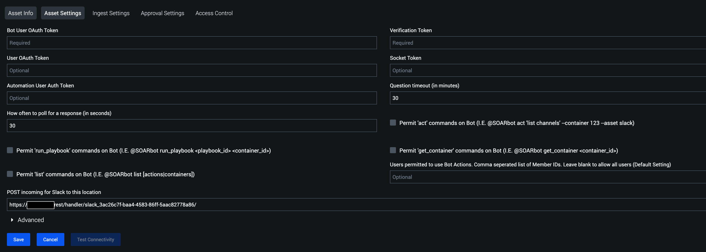

[comment]: # " File: README.md"
[comment]: # "  Copyright (c) 2016-2023 Splunk Inc."
[comment]: # ""
[comment]: # "  Licensed under Apache 2.0 (https://www.apache.org/licenses/LICENSE-2.0.txt)"
[comment]: # ""
## Playbook Backward Compatibility

-   The existing action parameters have been modified for the actions given below. Hence, it is
    requested to the end-user to please update their existing playbooks by re-inserting | modifying
    | deleting the corresponding action blocks or by providing appropriate values to these action
    parameters to ensure the correct functioning of the playbooks created on the earlier versions of
    the app.

      

    -   Upload File - 4 new action parameters 'filename', 'content', 'parent_message_ts' and
        'filetype' are added which helps to add the file without specifying vault ID in 'file'
        parameter. The 'parent_message_ts' can be used to reply in the thread based on the timestamp
        of the parent message.

    <!-- -->

    -   Send Message - 2 new action parameters 'reply_broadcast' and 'parent_message_ts' are added
        which can be used to reply in the thread based on the timestamp of the parent message.

    <!-- -->

    -   Send Message - 1 new action parameter 'blocks' is added which can be used to send richly
        formatted "blocks" as Slack messages. See [Slack
        Documentation](https://api.slack.com/messaging/composing/layouts#adding-blocks) for more
        information.

-   New action 'Add Reaction' has been added. Hence, it is requested to the end-user to please
    update their existing playbooks by inserting the corresponding action blocks for this action on
    the earlier versions of the app.

## Authentication

SOAR's Slack App needs a bot token to read messages from and post messages to slack channels. The
app also needs a verification token to verify POST requests received from Slack.

### Steps for Creating a Slack App Using App Manifest File (Recommended)

App manifest file in (.yaml):  
  
Use below manifest file for creating slack app.  
  

    display_information:
      name: soarbot
    features:
      bot_user:
        display_name: soarbot
        always_online: false
    oauth_config:
      scopes:
        user:
          - channels:write
          - groups:write
          - im:write
          - mpim:write
          - channels:read
          - groups:read
          - im:read
          - mpim:read
          - users:read
          - users:read.email
          - chat:write
          - reactions:write
          - files:write
        bot:
          - channels:manage
          - groups:write
          - im:write
          - mpim:read
          - mpim:write
          - channels:read
          - groups:read
          - im:read
          - users:read
          - users:read.email
          - chat:write
          - reactions:write
          - files:write
          - chat:write.public
          - app_mentions:read
          - channels:history
          - im:history
    settings:
      event_subscriptions:
        bot_events:
          - app_mention
          - message.channels
          - message.im
      interactivity:
        is_enabled: true
      org_deploy_enabled: false
      socket_mode_enabled: true
      token_rotation_enabled: false

  
  
Select **From an app manifest** option.  
  
  
  
Select a workspace.  
  
  
  
Paste above manifest file in **yaml** section.  
  
  
  
Click **Next** , then verify all scopes for Bot and User which is added from the manifest file.  
  
  
  
Note that event subscriptions from the manifest file will also be added for the bot. Proceed by
clicking **Create** .  
  
  
  
On the next page, there is a **Verification Token** . This token is needed during asset
configuration.  
  
  
  
On the same page, there is an **App Level tokens** section. Click on the **Generate Token and
Scope** button. You will then be prompted to provide a token name, for example, **socket_token** .
Just below this is the **Add Scope** button. Add **connection:write & authorization:read** and click
on **Generate** . This token is needed during asset configuration.  
  
  
  
On the same page under the **Install your app** section, click **Install to Workspace** .  
  
  
  
On the next page, click **Allow** .  
  
  
  
After authorizing the app, in the menu bar on the left, select **OAuth & Permissions** . The **Bot
User OAuth Token** and **User OAuth Token** are required during asset configuration.  
  
  
  
On the same page, scroll down to the **Scopes** section and verify the scopes for Bot and User added
from the manifest file.  
  

### Steps for Creating a Slack App From Scratch

Creating a Slack App is required to get the proper bot token for authenticating the SOAR Slack App.
To do this, go to <https://api.slack.com/apps> in a browser, and select **Create New App** .  
  
  
  
In the pop up window, there are two options, select **From scratch** .This would open another pop
up, give the app name and associate it with a Slack team/your Workspace, then click **Create App**
.  
  
  
  
On the next page, there is a **Verification Token** . This token is needed during asset
configuration.  
  
  
  
On the same page, there is an **App Level tokens** section. Click on the **Generate Token and
Scope** button. You will then be prompted to provide a token name, for example, **socket_token** .
Just below this is the **Add Scope** button. Add **connection:write & authorization:read** and click
on **Generate** . This token is needed during asset configuration.  
  
  
  
In the menu bar on the left, select **OAuth & Permissions** . On that page, Scroll down to the
**Scopes** section and click **Add an OAuth Scope** to add scopes to your **Bot Token** and **User
Token** .  
  
  
  
The required scopes are given below, please add the particular scope to use that specific action.  
  

<table>
<colgroup>
<col style="width: 33%" />
<col style="width: 33%" />
<col style="width: 33%" />
</colgroup>
<thead>
<tr class="header">
<th>Required Action Scopes</th>
<th></th>
<th></th>
</tr>
</thead>
<tbody>
<tr class="odd">
<th>Action Name</th>
<th>Bot Token Scopes</th>
<th>User Token Scopes</th>
</tr>

<tr class="odd">
<td>Create Channel</td>
<td><ul>
<li>channels:manage</li>
<li>groups:write</li>
<li>im:write</li>
<li>mpim:write</li>
</ul></td>
<td><ul>
<li>channels:write</li>
<li>groups:write</li>
<li>im:write</li>
<li>mpim:write</li>
</ul></td>
</tr>
<tr class="even">
<td>List Channels</td>
<td><ul>
<li>channels:read</li>
<li>groups:read</li>
<li>im:read</li>
<li>mpim:read</li>
</ul></td>
<td><ul>
<li>channels:read</li>
<li>groups:read</li>
<li>im:read</li>
<li>mpim:read</li>
</ul></td>
</tr>
<tr class="odd">
<td>List Users</td>
<td><ul>
<li>users:read</li>
<li>users:read.email</li>
</ul></td>
<td><ul>
<li>users:read</li>
<li>users:read.email</li>
</ul></td>
</tr>
<tr class="even">
<td>Get User</td>
<td><ul>
<li>users:read</li>
<li>users:read.email</li>
</ul></td>
<td><ul>
<li>users:read</li>
<li>users:read.email</li>
</ul></td>
</tr>
<tr class="odd">
<td>Invite User</td>
<td><ul>
<li>channels:manage</li>
<li>groups:write</li>
<li>im:write</li>
<li>mpim:write</li>
</ul></td>
<td><ul>
<li>channels:write</li>
<li>groups:write</li>
<li>im:write</li>
<li>mpim:write</li>
</ul></td>
</tr>
<tr class="even">
<td>Send Message</td>
<td><ul>
<li>chat:write</li>
</ul></td>
<td><ul>
<li>chat:write</li>
</ul></td>
</tr>
<tr class="odd">
<td>Add Reaction</td>
<td><ul>
<li>reactions:write</li>
</ul></td>
<td><ul>
<li>reactions:write</li>
</ul></td>
</tr>
<tr class="even">
<td>Upload File</td>
<td><ul>
<li>files:write</li>
</ul></td>
<td><ul>
<li>files:write</li>
</ul></td>
</tr>
<tr class="odd">
<td>Ask Question/Ask Question Channel</td>
<td><ul>
<li>chat:write</li>
<li>chat:write.public</li>
</ul></td>
<td><ul>
<li>chat:write</li>
</ul></td>
</tr>
</tbody>
</table>

NOTE: **chat:write** replaces both **chat:write:user** and **chat:write:bot** and **files:write**
replaces both **files:write:user** and **files:write:bot**  
  
Next, click on **Install App** in the side bar. On that page, click **Install to Workspace** .  
  
  
  
On the next page, click **Allow** .  
  
  
  
After authorizing the app, in the menu bar on the left, select **OAuth & Permissions** . The **Bot
User OAuth Token** and **User OAuth Token** are required during asset configuration.  
  

## SOAR Base URL

The app uses the SOAR **Base URL** configuration to generate links to actions, so please make sure a
valid url is specified in the **System Settings** .  
  
  
  
NOTE: If the PORT is other than 443, please add the port in the **BASE URL For Splunk SOAR**
field.  
  

## [SOAR Slack Asset](img/slack_system_settings_with_port.png)

[Fill out the required values in the **Asset Definition** tab.  
  
](img/slack_system_settings_with_port.png)
  
  
Fill out the **Bot User OAuth Token** , **User OAuth Token** , **Socket Token** and **Verification
Token** in the **Asset Settings** tab. Optionally specify permissions and authorized Member IDs if
you intend to use SlackBot features. Also, anytime you update the any of the tokens mentioned above,
please stop the bot once and restart the on poll to reflect the latest changes.  
  
**IMPORTANT NOTE:** if you modify the "Permit" check boxes or permitted users options (SlackBot
permissions) after asset creation, you will need to run POLL NOW with Maximum containers set to 1234
to restart the bot. Alternatively, you can stop and restart the bot.  
  
  
  
Click **SAVE** , you will be asked to fill in the **Ingest Settings** , select one of the labels
from the drop-down or you can create a new one and Click **SAVE** .  
  
  
  

### Automation User

The Slack app needs a SOAR authentication token to perform some tasks on the SOAR platform. To get
this token, it is recommended that you create a new automation user. The steps for creating this
user are as follows:

-   On the SOAR platform, navigate to **Administration->User Management**

-   Under **Users** , click **+ USER**

-   In the **Add User** wizard, do the following:

      

    -   Set the **User Type** to **Automation**
    -   Give the user a **Username** like "Slack Automation"
    -   For security reasons, accessing 127.0.0.1 is not allowed. Set **Allowed IPs** same as the
        **instance IP or "any"** . (eg : If instance IP is 10.1.18.123, set allowed IP also
        10.1.18.123)
    -   Set the **Default Label** to the label seen in the Slack asset's **Ingest Settings**
    -   Under **Roles** , in addition to the default **Automation** role, add the **Observer** role
    -   Click **CREATE**

      
      

-   Once the new user is created, click on the user in the user list

<!-- -->

-   On the user's page copy the **ph-auth-token** field from the **Authorization Configuration for
    REST API** box

      
      
      

-   Paste the copied token in the **Automation User Auth Token** on the Slack app's **Asset
    Settings** page

### Test Connectivity

Now, on the **Asset Settings** page, click the **TEST CONNECTIVITY** button, which will display a
text box with progress messages. It will show the bot username and bot user ID that SOAR received
from Slack. Please ensure that these are correct.  
  

## Set up Interactivity in Slack

Go to the **Your apps** option in Slack. From the menu on the left select the **Interactivity &
Shortcuts** option.  
  
NOTE: Slack will only send POST requests to endpoints that have an SSL certificate signed by a
certificate authority.  
  
  
  
Once on this page, toggle on **Interactivity** . Configure the **Request URL** . To do so just copy
the value of url provided in the field **POST incoming for Slack to this location** in **Asset
Settings** of slack asset and paste it in the **Request URL** field of **Slack Apps** .  
  
  
  
NOTE : Slack Apps provided two ways to handle interactions on their apps, using **Request URL** and
**WebSockets** .At a time only one mode can be used, either Request URL or Socoket mode. The Slack
Bot uses web sockets internally, there it is suggested to make to assests for using slack actions
and bot simultaneously. One asset to perform slack actions from phantom and another asset to use
commands on slack for phantom. Using one asset for both can cause issue.  
  

## Set up Socket Mode in Slack

Go to the **Your apps** option in Slack. From the menu on the left select the **Socket Mode**
option.  
  
  
  
Once on this page, toggle on **Socket Mode** . Then click on the event subscription option. This
will redirect you to the Event Subscription page, and add the following subscriptions for bot.  
  
  
  
Note: When socket mode is enabled, click on **Interactivity & Shortcuts** on the left menu bar and
verify that the **Request URL** field is empty in the **Interactivity** section.  
  
  
  

## Slack Bot

### Ingest Settings

To run the SOAR SlackBot that will get SOAR to take commands from Slack, ingestion needs to be
enabled on the SOAR Slack Asset. To do this go back to the INGEST SETTINGS tab and enable polling
and specify the Polling interval as **off** . The "Label to apply to objects from this source"
setting is ignored by this app, so it can be set to anything.  
  
  
  
To check the status of the SOAR bot and restart it if not running, you can Click POLL NOW from the
INGEST SETTINGS app and then POLL NOW again. The "Source ID", "Maximum containers", and "Maximum
artifacts" settings can be ignored in this case.  
  
  
  
The POLL NOW window will display the PID of the SlackBot process as well as the number of artifacts
and containers ingested (which will always be zero for this app).  
  

### Restarting SlackBot

If SlackBot permissions are changed in the asset configuration, it is mandatory to restart SlackBot
for the new settings to go into affect. To restart SlackBot, use the POLL NOW option with a Maximum
container count of 1234.  
  
  
  
  

### Stopping SlackBot

Once the SOAR SlackBot starts running, the **stop bot** action needs to be run to stop it. Simply
disabling ingestion won't stop SlackBot. You may also run poll now with a Maximum container count of
the PID to stop SlackBot. To obtain the PID, run Poll Now with default parameters.  
  
WARNING: Stopping SlackBot is required before upgrading or uninstalling the SOAR Slack App or else
an untracked SlackBot process may be left running on the SOAR instance. In addition, deleting a
Slack asset that has SlackBot running will result in SlackBot continuing to run, untracked.  
  
  
  

## Slack Commands

Once a Slack asset has been configured, and SlackBot is running on SOAR, it needs to be invited to
the channel, and then commands from Slack can be received by SOAR. In Slack, just mention the bot to
get a help message on running commands. All commands follow this syntax:  
  

@BOT_NAME COMMAND COMMAND_PARAMETERS

  

### SlackBot Permissions

Granular permissions that control who, and what actions can be performed by SOAR SlackBot can be
defined in the asset configuration.

-   Permit 'act' commands on Bot (Boolean)

      

    -   Allow SlackBot commands that leverage the "act" operator
    -   Example: @SOARbot act 'list channels' --container 123 --asset slack

-   Permit 'run_playbook' commands on Bot (Boolean)

      

    -   Allow playbooks to be run on specific containers through SlackBot
    -   Example: @SOARbot run_playbook \<playbook_id> \<container_id>

-   Permit 'get_container' commands on Bot (Boolean)

      

    -   Allow SlackBot to obtain information about a specified container
    -   Example: @SOARbot get_container )

-   Permit 'list' commands on Bot (Boolean)

      

    -   Allow SlackBot commands that leverage the "list" operator
    -   Example: @SOARbot list \[actions|containers\]

-   Users permitted to use Bot Actions

      

    -   Provide Comma separated list of Member IDs to be permitted to use SlackBot commands. If left
        blank, all users will be permitted (default setting)
    -   Example: U01M3CLBL9Q, U01M4CLAP9M (NOTE: You must use the unique Member ID and not the
        username)

  

### Running Actions

To run an action on SOAR from Slack, use the **act** command. The syntax of which is:  
  

    @BOT_NAME act ACTION_NAME [--container CONTAINER_ID] [--asset ASSET] [--name NAME]
        [--type TYPE] [--parameters PARAMETER:VALUE [PARAMETER:VALUE]*]

    required parameters:
      ACTION_NAME       The name of the action to run on SOAR
      --container       ID of the container to run the action on

    optional parameters:
      --name            Set a name for the action (defaults to 'Slack generated action')
      --type            Set the type of the action (defaults to 'SOARbot')
      --asset           Name or ID of the asset to run the action on
                        If no asset is specified, the given action will run on all possible assets
      --parameters      List of parameter/value pairs in the format
                        param1:value1 param2:value2...

    examples:
      To run the action "list channels" on container 123 using the "slack" asset:

        @SOARbot act "list channels" --container 123 --asset slack

      To run the action "whois ip" on 1.1.1.1 using the "whois" asset:

        @SOARbot act "whois ip" --container 123 --asset whois --parameters ip:1.1.1.1

      To run all possible "whois ip" actions on 1.1.1.1 using all assets that support the action, and giving it the name "All WhoIs":

        @SOARbot act "whois ip" --container 123 --parameters ip:1.1.1.1 --name "All WhoIs"

  
After receiving an **act** command, SlackBot will kick off the action and send a link to the action
page to Slack. When the action is complete, SlackBot will send a summary of the action results to
Slack. If multiple actions are run at once, SlackBot will send action results for each action
separately as each action completes.  

### Running Playbooks

To run a playbook on SOAR from Slack, use the **run_playbook** command. The syntax of which is:  
  

    @BOT_NAME run_playbook [--repo REPO] PLAYBOOK CONTAINER_ID

    required parameters:
      PLAYBOOK          Name or ID of the playbook to run
      CONTAINER_ID      ID of container to run the playbook on

    optional parameters:
      --repo REPO       Name of the repo the playbook is in (required if the
                        playbook argument is a name and not an ID)"

    examples:
      To run the playbook "investigate" which is in the "community" repo, on container 123

        @SOARbot run_playbook --repo community investigate 123

      To run the playbook with ID 32 on container 123:

        @SOARbot run_playbook 32 123

  
After receiving a **run_playbook** command, SlackBot will kick off the playbook and send a link to
the container's mission control page to slack. When the playbook has finished running, SlackBot will
send a status report of the playbook's run to Slack.  

### Getting Container Information

To get information about a container, use the **get_container** command. The syntax of which is:  
  

    @BOT_NAME get_container [--container CONTAINER] [--tags TAG [TAG]*]

    parameters:
      --container       ID of the container to retrieve
      --tags            List of tags of containers to retrieve

    Only one of --container or --tags flags can be included at once
    Using the --tags flag will return a small summary of containers with the given tag.

    examples:
      To get information on container 123:

        @SOARbot get_container 123

      To get a list of containers with the tag "my_tag"

        @SOARbot get_container --tags my_tag

      To get a list of containers with one of the following tags: "tag1" "tag2" or "tag3"

        @SOARbot get_container --tags tag1 tag2 tag3

Running a **get_container** command will result in SlackBot sending either a list of containers or a
set of information on one container to Slack.  

### Listing Actions or Containers

To get a list of actions or containers, use the **list** command. The syntax of which is:  
  

    @BOT_NAME list [actions|containers]

    parameters:
      object        name of an object to list can be 'actions' or 'containers'

    WARNING: If there are many containers on the system, the 'list containers' command can take a long time and can result in a lot of data being dumped on Slack

    examples:
      To get a list of all actions on the SOAR instance:

        @SOARbot list actions

      To get a list of all containers on the SOAR instance:

        @SOARbot list containers

Running a **list** command will result in SlackBot sending a list of either actions or containers to
Slack.  
